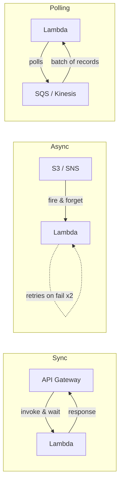
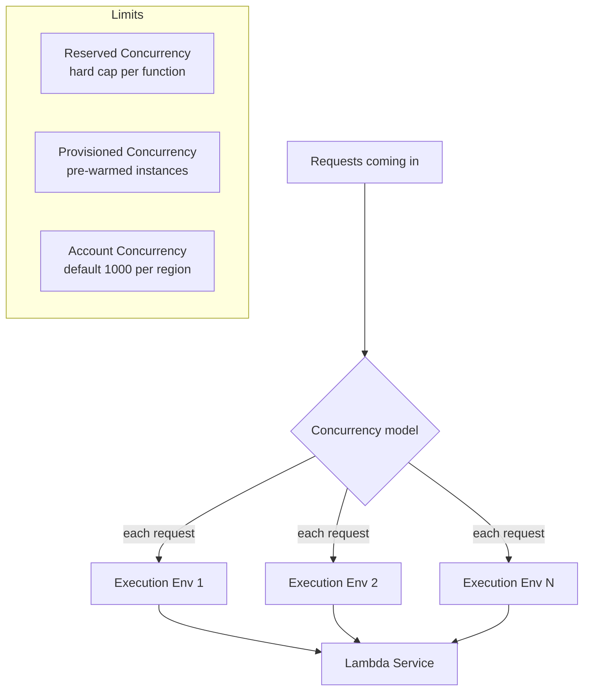
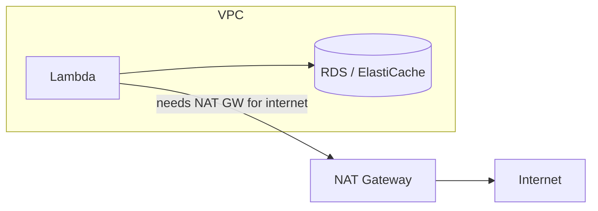

# AWS Lambda

- A serverless compute service, only billed when it is run (pay per use/execution model)
- **serverless**: There is still a server but I do not manage the server resources (os, ram, memory, etc...), I simply write a function (lambda function) that will get triggered whenever an event occurs (such as http req, file upload, schedule) -> AWS spins up a server -> does the job -> kills it.
- pros:
    - PAY AS YOU USE
    - Auto scaling (load-balancing)
    - Easy to integrate with other services
    - less management
- cons:
    - No control over low level infrastructure details (cannot control node count when scaling up/down, etc...)
    - Non persistent data: data stored in Lambda will be erased once the server dies (such as .txt, .json, etc..) - whichever file we use as DB.
    - 15 min max execution time — not suitable for long-running workloads

- Difference between EC2 (server) and Lambda (serverless) archi.

| Feature            | EC2                     | Serverless (Lambda)            |
|--------------------|--------------------------|--------------------------------|
| Server management  | You manage it           | AWS manages it                 |
| Scaling            | Manual or complex setup | Automatic, instant             |
| Cost when idle     | Still paying            | $0                             |
| Startup time       | Minutes to launch       | Milliseconds                   |
| Max run time       | Unlimited               | 15 minutes per function        |
| OS control         | Full control            | No control (AWS handles)       |
| Best for           | Long-running apps       | Short tasks, APIs, events      |
| Learning curve     | Steeper                 | Much easier to start           |

---

## Concepts

### Execution Model

```
Event Source → Lambda Service → Execution Environment → Your Handler → Response
```

- **Event Source**: entry point where the trigger enters Lambda (e.g. API Gateway, S3, EventBridge)
- **Lambda Service**: AWS orchestration layer → decides to cold start or reuse a warm env, passes the event JSON
- **Execution Environment**: isolated container where code lives/runs
    - Handler receives the JSON → passes to app (e.g. FastAPI via Mangum) → gets response → returns to Lambda → API Gateway → user

---

### Invocation Types

| Type | How | Example |
|------|-----|---------|
| **Synchronous** | Caller waits for response | API Gateway, SDK direct invoke |
| **Asynchronous** | Lambda queues event, caller gets 202 immediately | S3 event, SNS, EventBridge |
| **Event source mapping** | Lambda polls a stream/queue | SQS, Kinesis, DynamoDB Streams |



---

### Cold Starts

A cold start happens when Lambda has to spin up a brand new execution environment because no warm one is available.

```
Cold Start:  [Download code] → [Start runtime] → [Init module-level code] → [Run handler]
Warm Start:                                                                 → [Run handler]
```

**How to minimize cold starts:**

| Strategy | How |
|----------|-----|
| Provisioned Concurrency | Pre-warms N environments — always ready, no init phase |
| Keep functions warm | EventBridge rule pings every 5 min — hacky but works |
| Reduce package size | Smaller ZIP = faster download. Tree-shake, don't bundle unused libs |
| Faster runtime | Go/Rust < Node.js/Python << Java/C# (JVM/CLR worst for cold starts) |
| Move init outside handler | DB connections, SDK clients initialized at module level persist across warm invocations — delays cold start once, saves time on every warm call |

---

### Concurrency



- **Reserved Concurrency**: max concurrent executions for a specific function (also throttles others from stealing capacity)
- **Provisioned Concurrency**: pre-initialized environments — eliminates cold starts, costs more
- **Account limit**: 1000 concurrent executions per region by default (can be increased via support ticket)

---

### Lambda Layers

- A layer is a ZIP archive with libraries, dependencies, or custom runtimes that multiple functions can share
- Avoids packaging the same dependencies in every function ZIP
- Up to 5 layers per function; each layer + function code combined must be ≤ 250 MB unzipped

```
Function ZIP (your code only)
  + Layer 1 (numpy, pandas)
  + Layer 2 (shared utilities)
  = /var/task/ at runtime
```

---

### Configuration

| Setting | Notes |
|---------|-------|
| **Memory** | 128 MB – 10,240 MB. CPU scales proportionally with memory |
| **Timeout** | 1 sec – 900 sec (15 min). Set just above expected max run time |
| **Environment Variables** | Key-value pairs available to code via `os.environ`. Encrypt with KMS for secrets |
| **Execution Role (IAM)** | IAM role Lambda assumes — grants permissions to call other AWS services |
| **VPC** | Attach Lambda to a VPC to access private RDS, ElastiCache, etc. Adds cold start latency |

---

### VPC Integration

By default Lambda runs outside your VPC (has internet access). Attach to VPC when you need to reach private resources.



- Requires subnets + security group
- Needs a NAT Gateway if the function also needs internet access
- Adds ~1s cold start due to ENI creation (mitigated with Provisioned Concurrency)

---

## Example: Hosting FastAPI app with Lambda

### Step 1: Create Lambda function
- AWS Console → Lambda → Create function
- Author from scratch → give a name and runtime
- Leave defaults for the rest

### Step 2: Handler setup
- **AWS Lambda connects to the backend via a handler function. For FastAPI, use the `mangum` package to create a handler that routes all requests to FastAPI.**
- `handler = Mangum(app)` in `main.py` → handler reference becomes `main.handler`

### Step 3: Package dependencies
```bash
# Install all requirements into lib/
pip install -t lib -r requirements.txt

# ZIP dependencies first (from inside lib/)
cd lib && zip ../lambda_function.zip -r .

# Add application code
zip lambda_function.zip -u main.py
zip lambda_function.zip -u books.json
```
> Use Linux when zipping — AWS Lambda runs on Linux. WSL works fine on Windows.

### Step 4: Upload ZIP
- Lambda console → Code tab → Upload from → .zip file
- Runtime settings → Edit handler → set to `main.handler`
- Confirm Python version matches your local version

### Step 5: Test
- Test tab → Create new event → Template: `API Gateway AWS Proxy`
- Set correct `httpMethod` and `path` in the event JSON (appears in ~3 places)
- Run test → check response

**Alternatively — Function URL (quick access without API Gateway):**
- Configuration tab → Function URL → Create
- Auth type: None (for public access)
- Use the generated URL directly in the browser / Postman like a normal base URL

---

##### Resources:
- Simple AWS Lambda (YT) - https://www.youtube.com/watch?v=S0rlj67cTHw
