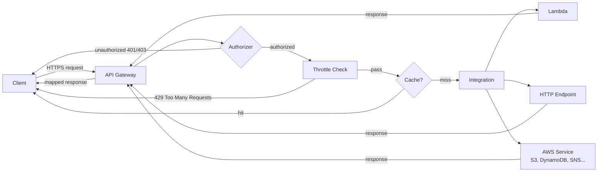
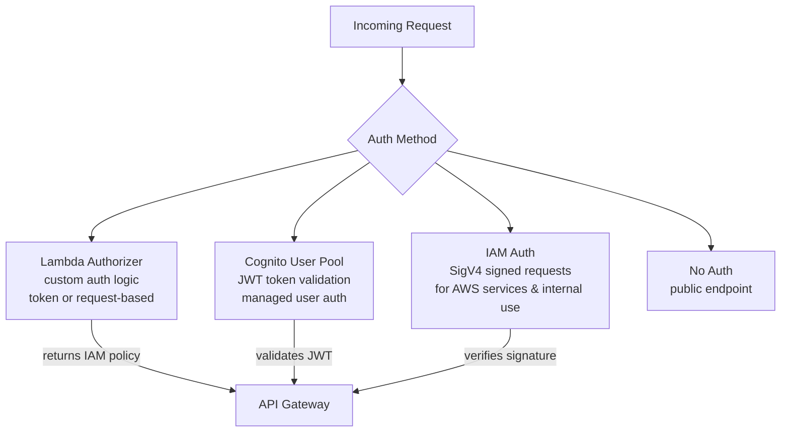
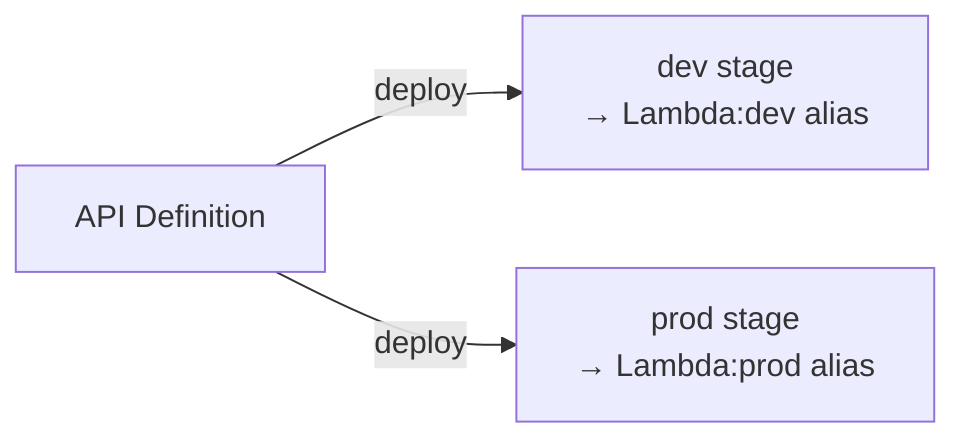

# API Gateway

- AWS managed service to create, publish, maintain, monitor, and secure REST, HTTP, and WebSocket APIs at any scale
- Acts as the front door for clients to reach backend AWS resources (Lambda, EC2, any HTTP endpoint, etc.)
- Handles traffic management, auth, throttling, caching, and request/response transformation — so the backend doesn't have to

---

## API Types

| Feature | REST API | HTTP API | WebSocket API |
|---------|----------|----------|---------------|
| Use case | Feature-rich public APIs | Low-latency, low-cost APIs | Real-time two-way communication |
| Pricing | Higher | ~70% cheaper than REST | Per message + connection |
| Auth | IAM, Cognito, Lambda authorizer | IAM, Cognito, Lambda authorizer, JWT | IAM, Lambda authorizer |
| Caching | Yes | No | No |
| Request validation | Yes | No | No |
| Usage plans / API keys | Yes | No | No |
| Private integrations | Yes | Yes | No |
| Best for | Production public APIs needing full control | Microservices, Lambda proxies, simple APIs | Chat, live feeds, gaming |

> **Rule of thumb**: Use HTTP API unless you specifically need caching, API keys/usage plans, or request validation — it's cheaper and faster.

---

## Request Flow

---

## Integration Types

| Type | What it does |
|------|--------------|
| **Lambda Proxy** | Passes entire request as-is to Lambda (headers, body, path, query string all in one event object). Response must follow a specific format. Most common with FastAPI/Mangum. |
| **Lambda Custom** | You define explicit request/response mapping templates (Velocity Template Language). More control, more work. |
| **HTTP Proxy** | Forwards request to an HTTP endpoint unchanged |
| **HTTP Custom** | Forwards with VTL transformation |
| **AWS Service** | Directly integrates with AWS services (e.g., put item in DynamoDB without Lambda) |
| **Mock** | Returns a static response — useful for testing |

---

## Authentication & Authorization

- **IAM**: caller signs request with AWS credentials (SigV4). Best for service-to-service.
- **Cognito User Pool**: user logs in → gets JWT → passes in `Authorization` header → API Gateway validates automatically.
- **Lambda Authorizer**: fully custom — parse any token format, call any auth service, return an IAM policy.
    - **Token-based**: receives a bearer token (JWT, OAuth)
    - **Request-based**: receives full request context (headers, query params)
- Authorizer responses are cached by default (TTL configurable) to avoid invoking the Lambda on every request.

---

## Stages & Deployments

- Changes to an API don't go live until you **deploy** to a **stage**
- A stage is a named snapshot of your API (e.g. `dev`, `staging`, `prod`)
- Each stage gets its own URL: `https://{api-id}.execute-api.{region}.amazonaws.com/{stage}`
- Stage variables: like environment variables for a stage — can point different stages at different Lambda aliases or backends

---

## Throttling

- Protects backend from traffic spikes
- Configured at the stage level (default) or per-route

| Setting | Meaning |
|---------|---------|
| **Rate limit** | Steady-state requests per second (RPS) |
| **Burst limit** | Max concurrent requests during a spike (token bucket algorithm) |

> Default account limits: 10,000 RPS rate, 5,000 burst per region. Can be increased via support.

**To configure in console:**
- API Gateway → choose API → Throttling (under Protect) → Edit Default route throttling → set Rate and Burst

---

## CORS

- Required when a browser-based frontend (different domain) calls your API
- API Gateway can handle CORS preflight (`OPTIONS`) responses automatically
- For HTTP API: enable CORS in console/template, specify allowed origins, methods, headers
- For REST API with Lambda Proxy: Lambda must return `Access-Control-Allow-Origin` in response headers

---

## Caching (REST API only)

- API Gateway can cache backend responses per stage/route
- Cache key: by default the full request URL; can add query strings or headers to the key
- TTL: 0–3600 seconds (default 300s)
- Reduces backend calls and latency for repeated identical requests
- Cache size: 0.5 GB – 237 GB (costs extra)

---

## Custom Domains

- Replace the auto-generated URL (`https://{api-id}.execute-api...`) with your own domain
- Requires an ACM certificate in the same region
- Use Route 53 (or any DNS) to point your domain to the API Gateway endpoint

---

## Monitoring

- CloudWatch Logs: request/response logs per stage (enable in stage settings)
- CloudWatch Metrics: `Count`, `Latency`, `IntegrationLatency`, `4XXError`, `5XXError`
- X-Ray: distributed tracing — enable on the stage to trace end-to-end through API Gateway → Lambda

---

##### Resources:
- AWS API Gateway Docs - https://docs.aws.amazon.com/apigateway/latest/developerguide/
