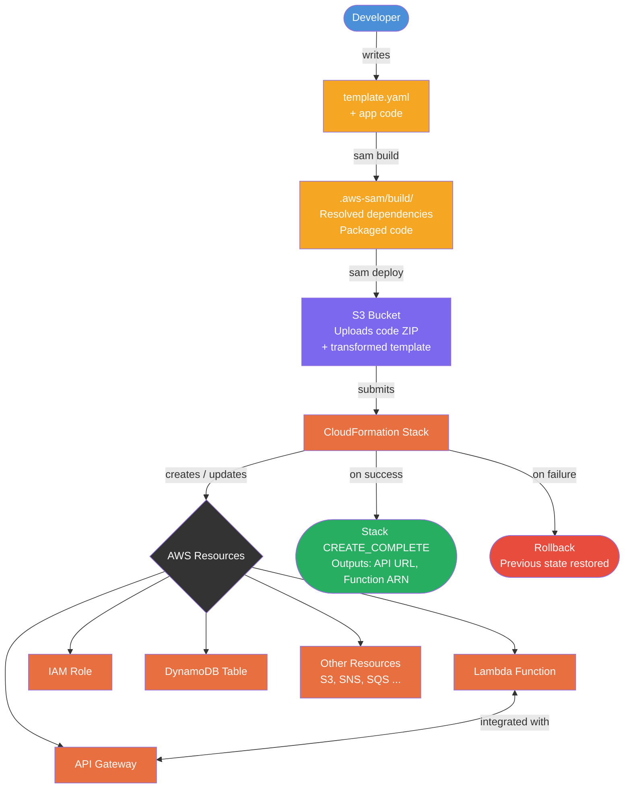

# SAM (Serverless Application Model)

- AWS open-source framework for building serverless applications using Infrastructure as Code (IaC)
- Write a `template.yaml` → SAM translates it → CloudFormation deploys the actual AWS resources
- No manual toggling in AWS Console; everything is reproducible and version-controlled
- SAM is a **superset of CloudFormation** — any valid CloudFormation resource works inside a SAM template

## Deployment Methods

| Method | How | When to use |
|--------|-----|-------------|
| **.zip (default)** | SAM zips code + deps → uploads to S3 → Lambda runs it directly | Simple Python/Node/Ruby functions |
| **Container (Docker)** | Builds a Docker image → pushes to ECR → Lambda pulls and runs it | Complex deps, custom runtimes, large packages |

---

## How SAM Works



---

## template.yaml Anatomy

```yaml
AWSTemplateFormatVersion: '2010-09-09'
Transform: AWS::Serverless-2016-10-31   # Required — tells CloudFormation this is a SAM template
Description: My FastAPI serverless app

# Globals: apply to all functions/APIs unless overridden at resource level
Globals:
  Function:
    Timeout: 30
    MemorySize: 256
    Runtime: python3.12
    Environment:
      Variables:
        ENV: production

Parameters:
  StageName:
    Type: String
    Default: dev

Resources:

  # SAM shorthand resource types (AWS::Serverless::*)
  MyFunction:
    Type: AWS::Serverless::Function
    Properties:
      Handler: app.main.handler         # file.module.variable
      CodeUri: app/                     # path to code dir (relative to template.yaml)
      Events:
        ApiEvent:
          Type: HttpApi                 # SAM auto-creates API Gateway + integration
          Properties:
            Path: /{proxy+}            # catch-all proxy
            Method: ANY
      Policies:
        - DynamoDBCrudPolicy:
            TableName: !Ref MyTable    # SAM policy templates = shorthand for common IAM patterns

  MyTable:
    Type: AWS::DynamoDB::Table         # standard CloudFormation resource — works as-is
    Properties:
      TableName: books
      BillingMode: PAY_PER_REQUEST
      AttributeDefinitions:
        - AttributeName: id
          AttributeType: S
      KeySchema:
        - AttributeName: id
          KeyType: HASH

Outputs:
  ApiUrl:
    Description: API Gateway endpoint URL
    Value: !Sub "https://${ServerlessHttpApi}.execute-api.${AWS::Region}.amazonaws.com/"
```

### Key SAM Resource Types (shorthand → CloudFormation expands these)

| SAM Type | Expands to |
|----------|-----------|
| `AWS::Serverless::Function` | Lambda + IAM Role + (optional) API Gateway |
| `AWS::Serverless::Api` | REST API Gateway + Deployment + Stage |
| `AWS::Serverless::HttpApi` | HTTP API Gateway (cheaper/faster) |
| `AWS::Serverless::SimpleTable` | DynamoDB table with single hash key |
| `AWS::Serverless::StateMachine` | Step Functions state machine |
| `AWS::Serverless::LayerVersion` | Lambda Layer |

### SAM Policy Templates
Shortcuts for common IAM permissions — avoids writing full IAM policy JSON:

```yaml
Policies:
  - S3ReadPolicy:
      BucketName: my-bucket
  - DynamoDBCrudPolicy:
      TableName: my-table
  - SQSPollerPolicy:
      QueueName: my-queue
```
Full list: https://docs.aws.amazon.com/serverless-application-model/latest/developerguide/serverless-policy-templates.html

---

## samconfig.toml

Auto-generated on first `sam deploy --guided`. Stores deploy answers so subsequent deploys don't need `--guided`.

```toml
version = 0.1

[default.deploy.parameters]
stack_name = "fastapi-bookapp"
s3_bucket = "aws-sam-cli-managed-default-samclisourcebucket-xxxx"
s3_prefix = "fastapi-bookapp"
region = "us-east-1"
confirm_changeset = true
capabilities = "CAPABILITY_IAM"
```

- `capabilities = "CAPABILITY_IAM"` — required when SAM creates IAM roles
- Edit this file to change deploy targets without re-running `--guided`

---

## CLI Commands

```bash
sam init                  # scaffold a new project with template.yaml
sam build                 # resolves deps, copies code to .aws-sam/build/
sam deploy --guided       # first deploy: prompts for config, writes samconfig.toml
sam deploy                # subsequent deploys using samconfig.toml
sam local start-api       # run API Gateway + Lambda locally (requires Docker)
sam local invoke MyFunc   # invoke a single function locally with a test event
sam logs -n MyFunc --tail # stream CloudWatch logs live
sam delete                # tear down the entire stack
```

> Always run `sam build` before `sam deploy` when code changes — it re-packages the new code.

---

## Example 1: FastAPI app with .zip

### Step 1: Prerequisites
- AWS account with IAM permissions (CloudFormation, Lambda, S3, API Gateway)
- AWS CLI configured (`aws configure`)
- SAM CLI installed
- Docker (for local testing only)

### Step 2: Lambda handler
- FastAPI needs `mangum` to translate Lambda events into ASGI requests
```python
# app/main.py
from fastapi import FastAPI
from mangum import Mangum

app = FastAPI()

@app.get("/books")
def get_books(): ...

handler = Mangum(app)   # this is what template.yaml points to
```

### Step 3: Scaffold template
```bash
sam init   # follow prompts, or write template.yaml manually
```

### Step 4: template.yaml key points
- `Handler: app.main.handler` — must match the file path and variable name
- `Events` with `Type: HttpApi` and `Path: /{proxy+}` → routes all paths to FastAPI's router
- Set `Globals.Function.Timeout` to something reasonable (30s for APIs)

### Step 5: Build & Deploy
```bash
sam build
sam deploy --guided   # first time
sam deploy            # after that
```

### Step 6: Test locally
```bash
sam local start-api   # Docker must be running
# API available at http://localhost:3000
```

---

## Example 2: FastAPI app with Docker

### Step 1: Same prerequisites + Docker image build

### Step 2: Dockerfile
```dockerfile
FROM public.ecr.aws/lambda/python:3.12
COPY requirements.txt .
RUN pip install -r requirements.txt --no-cache-dir
COPY app/ ${LAMBDA_TASK_ROOT}/app/
CMD ["app.main.handler"]
```

### Step 3: template.yaml changes
```yaml
Resources:
  MyFunction:
    Type: AWS::Serverless::Function
    Metadata:
      DockerTag: python3.12-v1
      DockerContext: .           # build context
      Dockerfile: Dockerfile
    Properties:
      PackageType: Image         # key difference vs .zip
      ImageConfig:
        Command: ["app.main.handler"]
      Events:
        Api:
          Type: HttpApi
          Properties:
            Path: /{proxy+}
            Method: ANY
```

### Step 4: Deploy
```bash
sam build
sam deploy --guided
```

> **Note**: Use `pathlib` or `os.path` for file paths inside container code — hardcoded paths will break.
> Local testing with `sam local start-api` does not work with the official AWS ECR base images.

---

###### Resources:
- AWS SAM Docs - https://docs.aws.amazon.com/serverless-application-model/latest/developerguide/
- AWS IAM Tutorial with Lambda (YT) - https://youtu.be/MipjLaTp5nA?si=J_uCwMrK8AHO7iop
