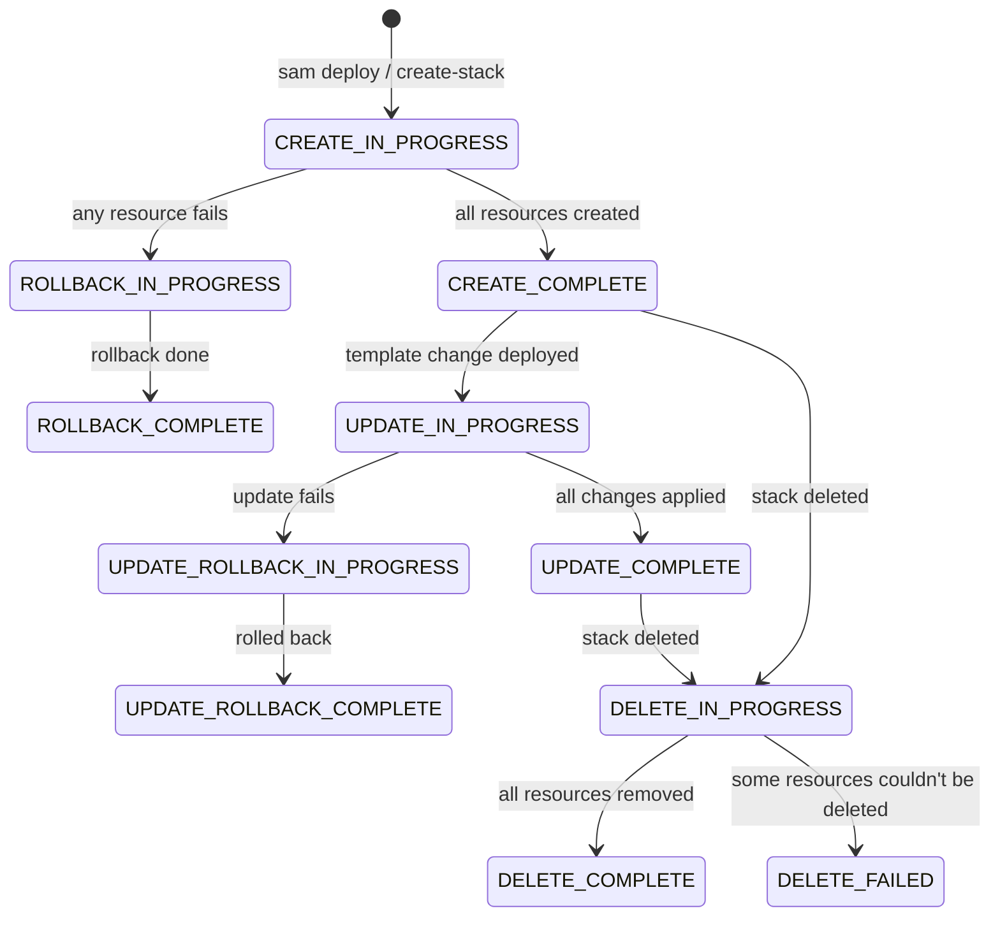
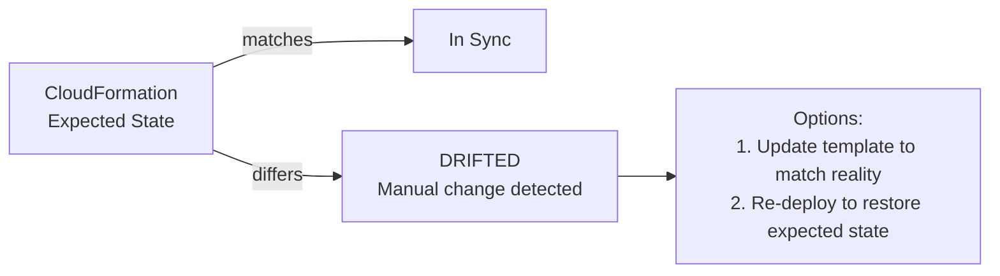

# CloudFormation

- AWS service that converts templates (containing IaC) into actual cloud resources
- Write a template (YAML or JSON) → CloudFormation creates/updates/deletes real AWS resources
- Everything is a **Stack** — a managed group of related resources that live and die together
- **SAM is built on top of CloudFormation** — SAM templates get transformed into CloudFormation templates before deployment

---

## Core Concepts

| Concept | What it is |
|---------|-----------|
| **Template** | YAML/JSON blueprint describing which resources to create and how to configure them |
| **Stack** | The live collection of AWS resources created from a template. One template = one stack |
| **ChangeSet** | Preview of what will change before actually applying an update — like `git diff` before a commit |
| **Drift** | When someone manually changes a resource outside CloudFormation — the stack is now "drifted" |
| **Rollback** | If a stack update fails, CloudFormation automatically reverts to the last known good state |

---

## Stack Lifecycle



---

## Template Anatomy

```yaml
AWSTemplateFormatVersion: '2010-09-09'   # always this value, optional but recommended
Description: Short description of the stack

# Parameters: inputs at deploy time — makes templates reusable
Parameters:
  Environment:
    Type: String
    Default: dev
    AllowedValues: [dev, staging, prod]
    Description: Deployment environment

# Mappings: static lookup tables (like a switch statement)
Mappings:
  EnvConfig:
    dev:
      InstanceType: t3.micro
    prod:
      InstanceType: t3.large

# Conditions: create resources only when a condition is true
Conditions:
  IsProd: !Equals [!Ref Environment, prod]

# Resources: REQUIRED — the only mandatory section
Resources:
  MyBucket:
    Type: AWS::S3::Bucket
    Properties:
      BucketName: !Sub "my-app-${Environment}-bucket"
      VersioningConfiguration:
        Status: !If [IsProd, Enabled, Suspended]   # conditional based on env

  MyFunction:
    Type: AWS::Lambda::Function
    DependsOn: MyBucket          # explicit dependency — creates MyBucket first
    Properties:
      FunctionName: !Sub "my-func-${Environment}"
      Runtime: python3.12
      Handler: main.handler
      Role: !GetAtt LambdaRole.Arn   # reference another resource's attribute
      Code:
        S3Bucket: !Ref MyBucket      # reference another resource by logical ID
        S3Key: lambda.zip

# Outputs: values exported after stack creation (API URLs, ARNs, etc.)
Outputs:
  BucketName:
    Description: Name of the S3 bucket
    Value: !Ref MyBucket
    Export:
      Name: !Sub "${AWS::StackName}-BucketName"   # cross-stack reference
```

---

## Intrinsic Functions

These are built-in functions for dynamic values inside templates:

| Function | What it does | Example |
|----------|-------------|---------|
| `!Ref` | Reference a resource (returns its ID) or parameter value | `!Ref MyBucket` |
| `!GetAtt` | Get a specific attribute of a resource | `!GetAtt MyFunction.Arn` |
| `!Sub` | String substitution with `${Variable}` syntax | `!Sub "arn:aws:s3:::${BucketName}"` |
| `!If` | Conditional value | `!If [IsProd, t3.large, t3.micro]` |
| `!Equals` | Compare two values → used in Conditions | `!Equals [!Ref Env, prod]` |
| `!Join` | Join a list with a delimiter | `!Join [":", [a, b, c]]` → `a:b:c` |
| `!Select` | Pick item from list by index | `!Select [0, [a, b, c]]` → `a` |
| `!Split` | Split a string into a list | `!Split [",", "a,b,c"]` |
| `!ImportValue` | Import an Output exported from another stack | `!ImportValue OtherStack-BucketName` |
| `!FindInMap` | Look up value in Mappings | `!FindInMap [EnvConfig, !Ref Env, InstanceType]` |

---

## Pseudo Parameters

Built-in variables AWS provides — no declaration needed:

| Parameter | Value |
|-----------|-------|
| `AWS::Region` | Current region, e.g. `us-east-1` |
| `AWS::AccountId` | Current AWS account ID |
| `AWS::StackName` | Current stack name |
| `AWS::StackId` | Full stack ARN |
| `AWS::NoValue` | Removes the property (used in conditionals) |

---

## ChangeSets

Before applying a potentially destructive update, use a changeset to preview changes:

```bash
# Create a changeset (doesn't apply anything yet)
aws cloudformation create-change-set \
  --stack-name my-stack \
  --template-body file://template.yaml \
  --change-set-name my-changeset

# Review what will change
aws cloudformation describe-change-set \
  --stack-name my-stack \
  --change-set-name my-changeset

# Apply it
aws cloudformation execute-change-set \
  --stack-name my-stack \
  --change-set-name my-changeset
```

> `sam deploy` with `confirm_changeset = true` in `samconfig.toml` automatically shows the changeset and asks for confirmation.

---

## Drift Detection

When someone manually changes a resource via the console or CLI (bypassing CloudFormation), the stack "drifts".



- Detect drift: CloudFormation console → Stack → Detect Drift
- Shows exactly which properties differ between expected and actual

---

## Nested Stacks

Break large templates into reusable modules:

```yaml
Resources:
  NetworkStack:
    Type: AWS::CloudFormation::Stack
    Properties:
      TemplateURL: https://s3.amazonaws.com/my-bucket/network.yaml

  AppStack:
    Type: AWS::CloudFormation::Stack
    DependsOn: NetworkStack
    Properties:
      TemplateURL: https://s3.amazonaws.com/my-bucket/app.yaml
      Parameters:
        VpcId: !GetAtt NetworkStack.Outputs.VpcId
```

---

## Useful CLI Commands

```bash
# Create a stack
aws cloudformation create-stack \
  --stack-name my-stack \
  --template-body file://template.yaml \
  --capabilities CAPABILITY_IAM

# Update a stack
aws cloudformation update-stack \
  --stack-name my-stack \
  --template-body file://template.yaml \
  --capabilities CAPABILITY_IAM

# Delete a stack (deletes ALL resources in it)
aws cloudformation delete-stack --stack-name my-stack

# List all stacks
aws cloudformation list-stacks

# Get stack outputs
aws cloudformation describe-stacks --stack-name my-stack \
  --query "Stacks[0].Outputs"

# Validate template syntax before deploying
aws cloudformation validate-template --template-body file://template.yaml
```

> `--capabilities CAPABILITY_IAM` is required when the template creates IAM resources (roles, policies). Without it, the create/update command is rejected.

---

##### Resources:
- CloudFormation Docs - https://docs.aws.amazon.com/cloudformation/
- CloudFormation Template Reference - https://docs.aws.amazon.com/AWSCloudFormation/latest/UserGuide/template-reference.html
