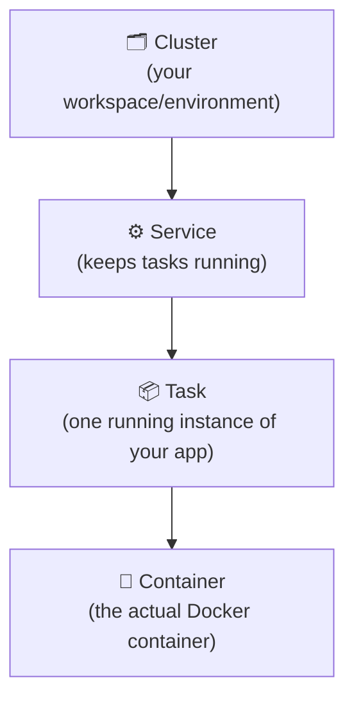
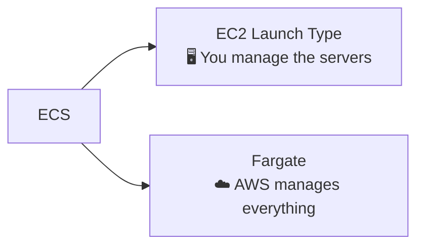
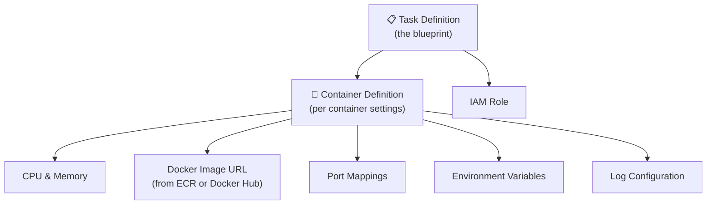
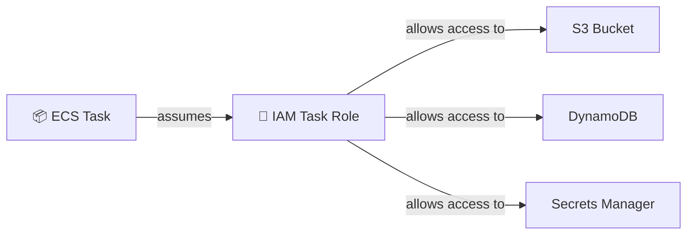
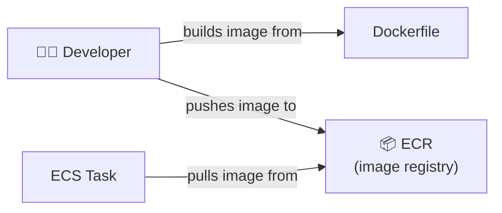
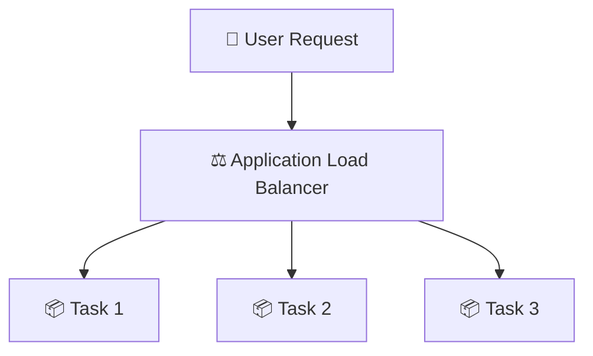
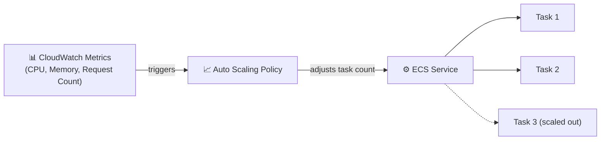
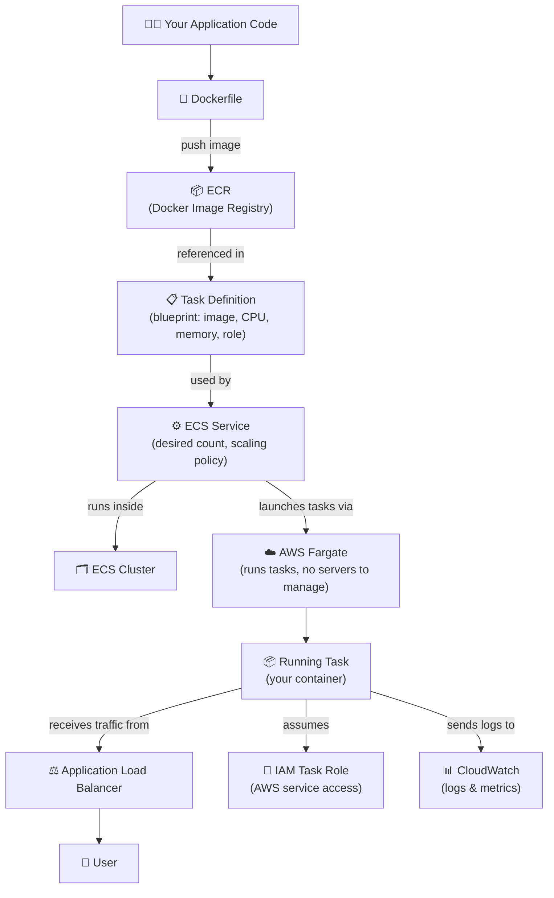

# Elastic Container Service (ECS)

ECS is AWS's managed service for running Docker containers. Think of it as: you package your app into a Docker image, hand it to ECS, and ECS takes care of running and managing it — no need to manually set up or babysit servers.

It sits in the middle ground between:
- **Lambda** — fully serverless, but very limited (short tasks, limited resources)
- **EC2** — full control, but you manage everything manually

With ECS you get flexibility without the overhead. Great for both one-off jobs and long-running production services.

---

## Core Concepts

### 1. Clusters, Services, and Tasks

These three are the building blocks of ECS:

| Term | What it is | Real-world analogy |
|---|---|---|
| **Cluster** | A logical grouping where your workloads live | A factory building |
| **Service** | Manages how many tasks are running and keeps them alive | A factory manager |
| **Task** | One running copy of your application | One worker/machine doing the job |
| **Container** | The Docker container inside the task | The actual tool the worker uses |

- A **cluster** can have multiple services.
- A **service** ensures a set number of tasks are always running (e.g., always keep 3 copies of your app up).
- A **task** is one running instance — it starts, does its job, and can be stopped.

---

### 2. EC2 Launch Type vs. Fargate

ECS can run your containers in two ways:

| | EC2 Launch Type | Fargate ✅ Preferred |
|---|---|---|
| **Server management** | You manage EC2 instances | AWS handles it |
| **Cost model** | Pay for EC2 instance uptime | Pay only for task runtime |
| **Control** | Full control over the host | Less control, but simpler |
| **Best for** | GPU workloads, custom kernel needs | Most standard workloads |

> **Use Fargate** unless you have a specific reason not to. It removes all server management overhead — you just define what your container needs (CPU, memory) and AWS runs it.

---

### 3. Task Definitions and Container Definitions

A **Task Definition** is a blueprint (like a recipe) that tells ECS how to run your container.

- A task definition can define **multiple containers** (e.g., your app + a sidecar logging agent).
- You version task definitions — when you update it, ECS creates a new revision (v1, v2, v3...).

---

### 4. IAM Roles for Tasks

Your running container often needs to access other AWS services (e.g., read from S3, write to DynamoDB). You grant this through an **IAM Task Role**.

- **Task Role** — permissions your container code uses (e.g., read S3).
- **Task Execution Role** — permissions ECS itself uses to set up the task (e.g., pull the image from ECR, send logs to CloudWatch).

> Never hardcode AWS credentials in your container. Use IAM Task Roles instead.

---

### 5. ECR — Elastic Container Registry

Before ECS can run your container, it needs to pull the Docker image from somewhere. **ECR** is AWS's private Docker image registry — think of it as Docker Hub, but inside your AWS account.

**Typical workflow:**
1. Write your app + `Dockerfile`
2. Build the image: `docker build -t my-app .`
3. Push to ECR: `docker push <account>.dkr.ecr.<region>.amazonaws.com/my-app:latest`
4. Reference that image URL in your Task Definition
5. ECS pulls and runs it

---

### 6. Load Balancing with ALB

When you have multiple tasks running (for high availability or scaling), you need a way to distribute traffic between them. An **Application Load Balancer (ALB)** does this.

- The ALB sits in front of your ECS service.
- As tasks scale up or down, the ALB automatically knows which tasks are healthy and routes traffic accordingly.
- You get a single DNS endpoint for your users, regardless of how many tasks are behind it.

---

### 7. Service Auto-Scaling

ECS Services can automatically scale the number of running tasks based on load.

**Scaling strategies:**
| Strategy | How it works |
|---|---|
| **Target Tracking** | Keep a metric (e.g., CPU) at a target value. Simplest option. |
| **Step Scaling** | Add/remove tasks in steps based on alarm thresholds. |
| **Scheduled Scaling** | Scale up/down at specific times (e.g., business hours). |

---

## How ECS Works End-to-End

Here's the full picture from code to running app:

---

## Quick Reference

| Concept | One-liner |
|---|---|
| **Cluster** | The environment/workspace that contains everything |
| **Service** | Keeps N tasks running; handles scaling and restarts |
| **Task** | One running instance of your containerized app |
| **Task Definition** | Blueprint: which image, how much CPU/memory, which role |
| **Fargate** | Run containers without managing servers (preferred) |
| **ECR** | AWS's private Docker image registry |
| **IAM Task Role** | Grants your container access to AWS services |
| **ALB** | Distributes traffic across multiple running tasks |
| **Auto Scaling** | Automatically adjusts task count based on load |

---

###### Resources:
- AWS Official getting-started page: https://aws.amazon.com/ecs/getting-started/
- Getting started with ECS (YT): https://www.youtube.com/watch?v=I9VAMGEjW-Q
- ECS Implementation (YT) **Follow exactly to deploy**: https://www.youtube.com/watch?v=zs3tyVgiBQQ
