# Elastic Kubernetes Service (EKS)

EKS is AWS's managed Kubernetes service. Kubernetes (K8s) is an open-source system for automating deployment, scaling, and management of containerized apps. EKS lets you run Kubernetes without having to install and operate your own control plane.

**Kubernete,** also known as K8s, is an open source system for automating deployment, scaling, and management of containerized applications.

It sits at the more powerful (and complex) end of the container spectrum:
- **ECS** — simpler, AWS-native, less control
- **EKS** — industry-standard Kubernetes, more flexibility and portability
- **EC2** — full control, you manage everything manually

Use EKS when you need Kubernetes specifically — for portability across clouds, large multi-team setups, or when you're already using K8s tooling.

---

## Core Concepts

### 1. Control Plane vs. Data Plane

EKS splits into two layers:

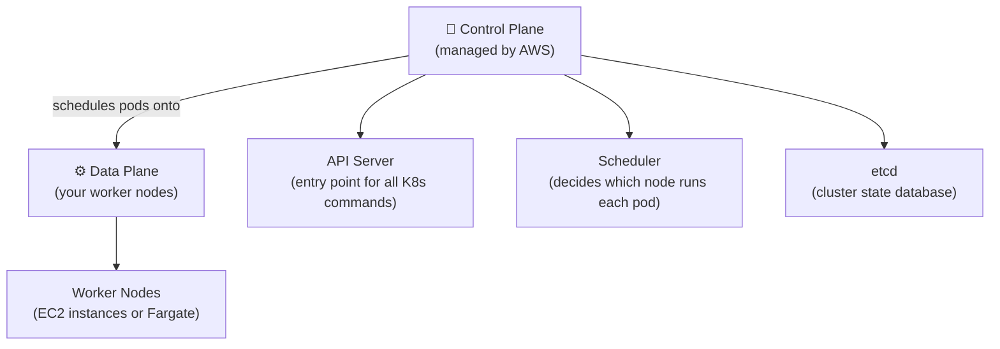

- **Control Plane** — the brain of the cluster. AWS runs and manages this in EKS (patching, HA, scaling). You pay a flat hourly fee per cluster.
- **Data Plane** — the worker nodes where your pods actually run. You choose how to manage these (see Node Groups section).

---

### 2. Kubernetes Fundamentals

#### Pods

A **Pod** is the smallest deployable unit in K8s — it wraps one or more containers that share networking and storage. Pods are ephemeral: they can die and be replaced at any time.

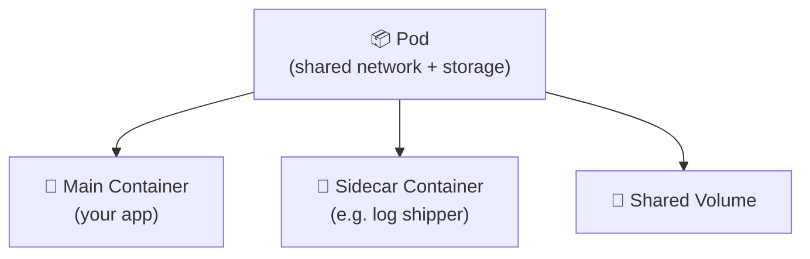

- All containers in a pod share the same IP and can talk via `localhost`.
- Usually one container per pod — sidecars are the exception, not the rule.

#### Deployments

A **Deployment** is how you declare what to run and how many replicas to keep alive. It manages a **ReplicaSet** which ensures N pods are always running:

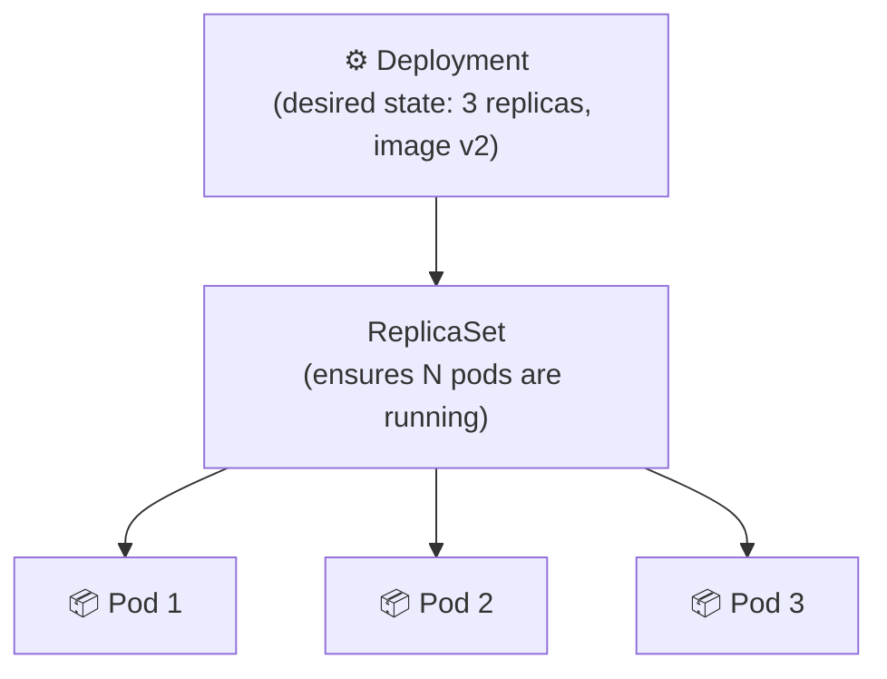

- Pod crashes → ReplicaSet auto-replaces it.
- Image update → Deployment does a **rolling update**: new pods come up, old pods shut down, zero downtime.

```yaml
# deployment.yaml
apiVersion: apps/v1
kind: Deployment
metadata:
  name: my-app
spec:
  replicas: 3
  selector:
    matchLabels:
      app: my-app
  template:
    metadata:
      labels:
        app: my-app
    spec:
      containers:
        - name: my-app
          image: <account>.dkr.ecr.<region>.amazonaws.com/my-app:latest
          ports:
            - containerPort: 8080
```

#### Services

Pods get new IPs every time they restart. A **K8s Service** gives you a stable DNS name and IP that always points to healthy pods:

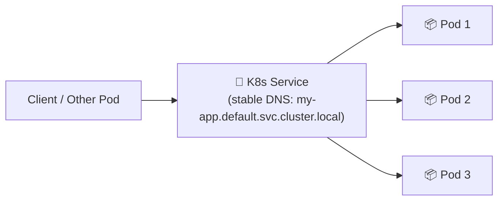

| Service Type | Scope | Use case |
|---|---|---|
| **ClusterIP** | Internal only | Pod-to-pod communication inside the cluster |
| **NodePort** | External via node IP | Simple testing/dev access |
| **LoadBalancer** | External via AWS ELB | Production external traffic |
| **Ingress** | External, HTTP routing | Host/path-based routing — pairs with ALB controller |

```yaml
# service.yaml
apiVersion: v1
kind: Service
metadata:
  name: my-app
spec:
  selector:
    app: my-app       # routes to pods with this label
  ports:
    - port: 80
      targetPort: 8080
  type: ClusterIP
```

#### Namespaces

**Namespaces** are virtual clusters inside a single EKS cluster — a way to isolate resources between teams, environments, or apps:

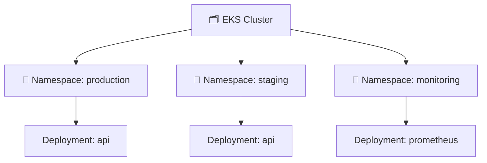

- Resources in different namespaces are isolated by default — no name collision.
- You can apply RBAC policies and resource quotas per namespace.
- Default namespaces: `default`, `kube-system` (K8s internals), `kube-public`.

```bash
kubectl create namespace staging
kubectl get pods -n staging          # list pods in a specific namespace
kubectl get pods --all-namespaces    # list pods across all namespaces
```

---

### 3. EKS Cluster Creation with eksctl

**`eksctl`** is the official CLI for EKS — the simplest way to create and manage clusters. It handles VPC, subnets, IAM roles, and node groups automatically.

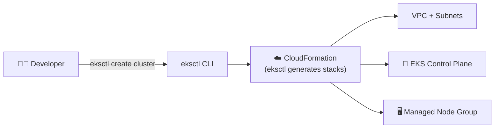

**Install eksctl:**
```bash
# macOS
brew tap weaveworks/tap && brew install weaveworks/tap/eksctl

# Windows (via Chocolatey)
choco install eksctl
```

**Create a cluster (simplest — uses defaults):**
```bash
eksctl create cluster \
  --name my-cluster \
  --region eu-west-1 \
  --nodegroup-name standard-nodes \
  --node-type t3.medium \
  --nodes 2
```

This single command creates: a VPC, subnets, the EKS control plane, and a managed node group with 2 EC2 nodes — and updates your `~/.kube/config` so kubectl works immediately.

**Create a cluster from a config file (recommended for real projects):**
```yaml
# cluster.yaml
apiVersion: eksctl.io/v1alpha5
kind: ClusterConfig

metadata:
  name: my-cluster
  region: eu-west-1
  version: "1.29"

managedNodeGroups:
  - name: app-nodes
    instanceType: t3.medium
    minSize: 2
    maxSize: 5
    desiredCapacity: 2
    privateNetworking: true

fargateProfiles:
  - name: batch-jobs
    selectors:
      - namespace: batch
```

```bash
eksctl create cluster -f cluster.yaml
```

**Other useful eksctl commands:**
```bash
eksctl get cluster                            # list clusters
eksctl delete cluster --name my-cluster       # delete cluster + all resources
eksctl create nodegroup -f cluster.yaml       # add a node group to existing cluster
eksctl upgrade cluster --name my-cluster      # upgrade K8s version
```

---

### 4. Managed Node Groups vs. Fargate Profiles

You choose how worker nodes are provisioned per workload:

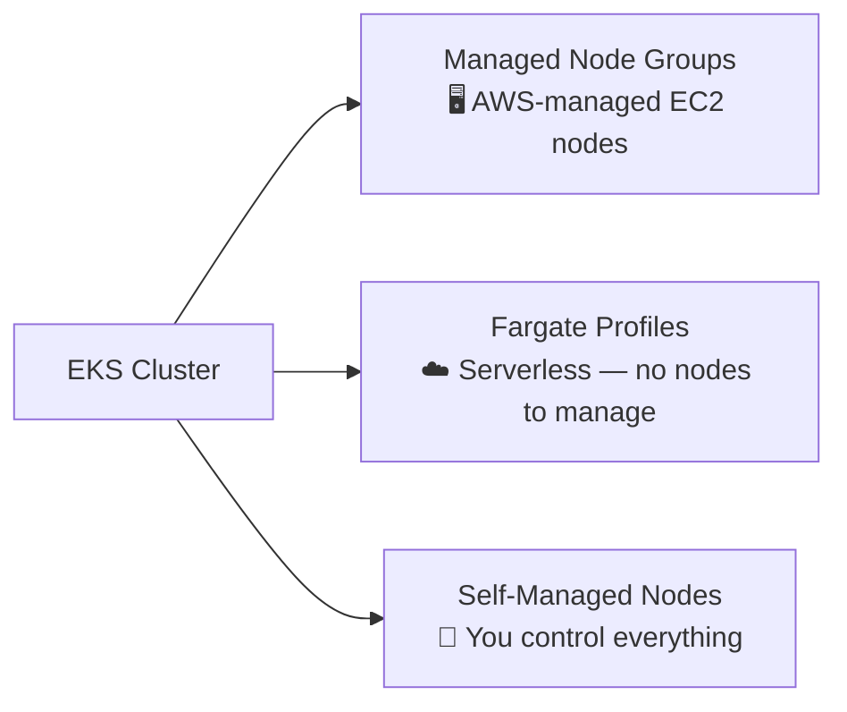

#### Managed Node Groups
AWS provisions and manages the EC2 instances. You define instance type, min/max count, and auto-scaling. Node updates (OS patches, K8s version) are done with a single `eksctl` command.

```bash
# Add a node group
eksctl create nodegroup \
  --cluster my-cluster \
  --name gpu-nodes \
  --node-type p3.2xlarge \
  --nodes 1

# Update node group AMI (rolling update)
eksctl upgrade nodegroup --name app-nodes --cluster my-cluster
```

#### Fargate Profiles
Instead of EC2 nodes, pods run on AWS-managed serverless infrastructure. You define a **Fargate Profile** — a set of namespace + label selectors. Any pod matching the selector runs on Fargate automatically.

```yaml
# Fargate profile: any pod in the "batch" namespace runs serverless
fargateProfiles:
  - name: batch-jobs
    selectors:
      - namespace: batch
        labels:
          workload: batch
```

```bash
eksctl create fargateprofile \
  --cluster my-cluster \
  --name batch-jobs \
  --namespace batch
```

| | Managed Node Groups | Fargate Profiles |
|---|---|---|
| **Infrastructure** | EC2 instances (you pick type) | Fully serverless |
| **Cost model** | Pay for running EC2 | Pay per pod vCPU/memory/second |
| **Node management** | AWS handles patching | No nodes at all |
| **DaemonSets** | ✅ Supported | ❌ Not supported |
| **Persistent volumes (EBS)** | ✅ Supported | ❌ Not supported |
| **Best for** | General workloads, stateful apps | Batch jobs, stateless bursty workloads |

> Mix both: run your main app on Managed Node Groups, and batch/scheduled jobs on Fargate.

---

### 5. kubectl with EKS

**`kubectl`** is the K8s command-line tool — you use it to deploy apps, inspect resources, and debug. After `eksctl create cluster`, your `~/.kube/config` is automatically updated.

**Connect kubectl to your EKS cluster:**
```bash
aws eks update-kubeconfig --region eu-west-1 --name my-cluster
```

**Essential kubectl commands:**

```bash
# --- Cluster info ---
kubectl cluster-info
kubectl get nodes                          # list worker nodes

# --- Namespaces ---
kubectl get namespaces
kubectl config set-context --current --namespace=production  # switch default namespace

# --- Pods ---
kubectl get pods                           # list pods in current namespace
kubectl get pods -n kube-system            # list pods in specific namespace
kubectl describe pod <pod-name>            # full details: events, status, resource usage
kubectl logs <pod-name>                    # view container stdout logs
kubectl logs <pod-name> -f                 # stream logs live
kubectl exec -it <pod-name> -- /bin/sh     # open a shell inside a running pod

# --- Deployments ---
kubectl apply -f deployment.yaml           # create or update from YAML
kubectl get deployments
kubectl rollout status deployment/my-app   # watch rollout progress
kubectl rollout undo deployment/my-app     # roll back to previous version
kubectl scale deployment my-app --replicas=5

# --- Services ---
kubectl get services
kubectl port-forward svc/my-app 8080:80   # forward local port to service (for testing)

# --- Debugging ---
kubectl get events --sort-by='.lastTimestamp'
kubectl top pods                           # CPU/memory usage (requires metrics-server)
kubectl top nodes
```

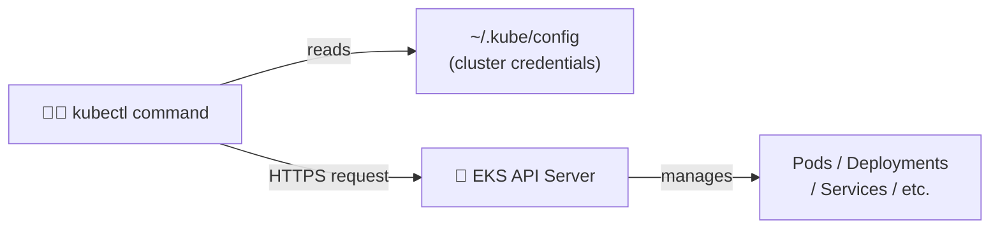

---

### 6. IAM Roles for Service Accounts (IRSA)

Pods often need to access AWS services (S3, DynamoDB, Secrets Manager). **IRSA** is the secure way to grant AWS permissions to specific pods — no hardcoded credentials, no broad node-level permissions.

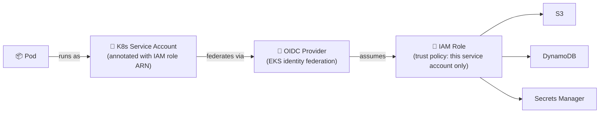

**How it differs from ECS Task Roles:**

| | ECS Task Role | EKS IRSA |
|---|---|---|
| **Scope** | Per task definition | Per K8s service account |
| **Mechanism** | IAM role attached to task | IAM role federated via OIDC |
| **Granularity** | Task level | Pod level (via service account) |

**Setup with eksctl:**
```bash
# 1. Enable OIDC provider on the cluster (one-time setup)
eksctl utils associate-iam-oidc-provider \
  --cluster my-cluster \
  --approve

# 2. Create IAM service account (creates the IAM role + K8s service account)
eksctl create iamserviceaccount \
  --name my-app-sa \
  --namespace production \
  --cluster my-cluster \
  --attach-policy-arn arn:aws:iam::aws:policy/AmazonS3ReadOnlyAccess \
  --approve
```

**Reference the service account in your deployment:**
```yaml
spec:
  serviceAccountName: my-app-sa   # pod inherits the IAM role
  containers:
    - name: my-app
      image: my-app:latest
```

> The pod receives temporary credentials via a projected volume — the AWS SDK picks them up automatically. No env vars or secrets needed.

---

### 7. Helm Chart Deployments

**Helm** is the package manager for Kubernetes — it bundles K8s YAML manifests into reusable, versioned **charts**. Think of it as `npm` or `apt` for Kubernetes apps.

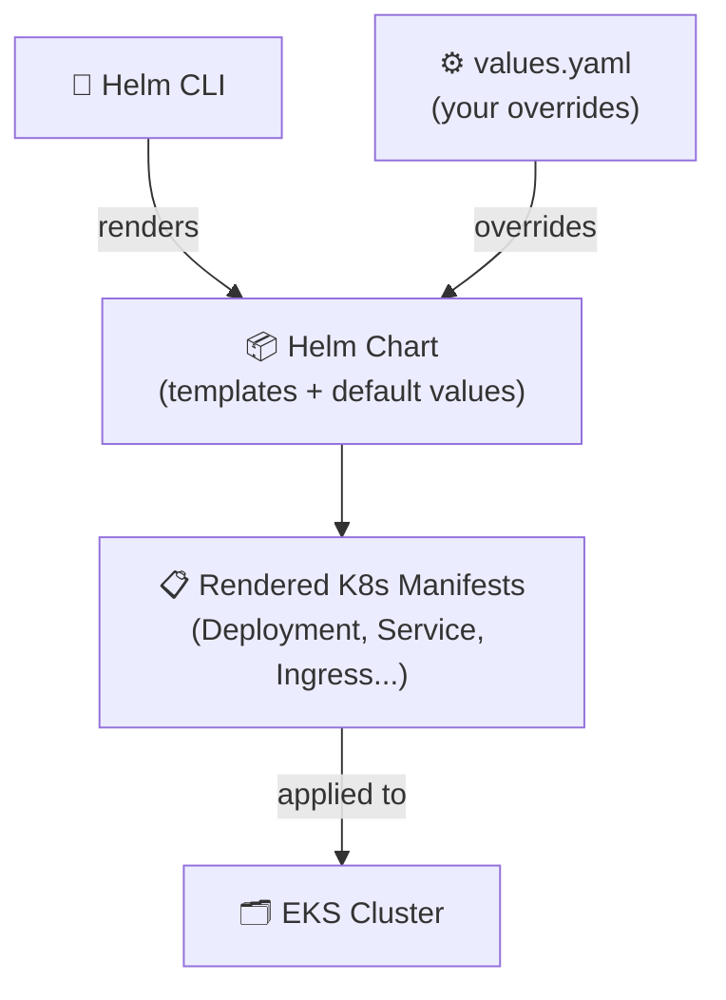

**Install Helm:**
```bash
brew install helm          # macOS
choco install kubernetes-helm   # Windows
```

**Core Helm concepts:**

| Term | What it is |
|---|---|
| **Chart** | A package of K8s YAML templates |
| **Release** | A deployed instance of a chart (you can have multiple releases of the same chart) |
| **Repository** | A collection of charts (like a package registry) |
| **values.yaml** | Default config for the chart — you override these at deploy time |

**Install an app from a public chart (e.g. ingress-nginx):**
```bash
# Add the chart repository
helm repo add ingress-nginx https://kubernetes.github.io/ingress-nginx
helm repo update

# Install the chart (creates a release named "ingress-nginx")
helm install ingress-nginx ingress-nginx/ingress-nginx \
  --namespace ingress-nginx \
  --create-namespace
```

**Install with custom values:**
```bash
# Override values inline
helm install my-app my-repo/my-chart \
  --set image.tag=v2.1.0 \
  --set replicaCount=3 \
  --namespace production

# Or use a values file (preferred for real projects)
helm install my-app my-repo/my-chart \
  -f prod-values.yaml \
  --namespace production
```

**Lifecycle commands:**
```bash
helm list -n production                          # list releases in a namespace
helm upgrade my-app my-repo/my-chart -f prod-values.yaml  # update a release
helm rollback my-app 1                           # roll back to revision 1
helm uninstall my-app -n production              # delete the release
helm history my-app                              # view revision history
```

**Create your own chart:**
```bash
helm create my-chart    # generates a chart scaffold
# Edit templates/ and values.yaml, then:
helm package my-chart   # packages into my-chart-0.1.0.tgz
helm install my-app ./my-chart -f custom-values.yaml
```

> Helm is the standard way to deploy third-party tools onto EKS (cert-manager, prometheus, external-dns, AWS Load Balancer Controller, etc.).

---

### 8. ECR — Container Images for EKS

Just like ECS, EKS pulls container images from a registry. **ECR** is the natural choice inside AWS:

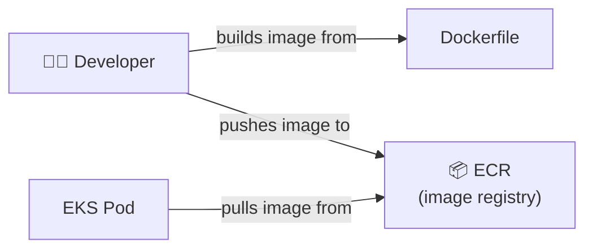

```bash
# Authenticate Docker to ECR
aws ecr get-login-password --region eu-west-1 | \
  docker login --username AWS --password-stdin <account>.dkr.ecr.eu-west-1.amazonaws.com

# Build, tag, push
docker build -t my-app .
docker tag my-app:latest <account>.dkr.ecr.eu-west-1.amazonaws.com/my-app:latest
docker push <account>.dkr.ecr.eu-west-1.amazonaws.com/my-app:latest
```

---

## How EKS Works End-to-End

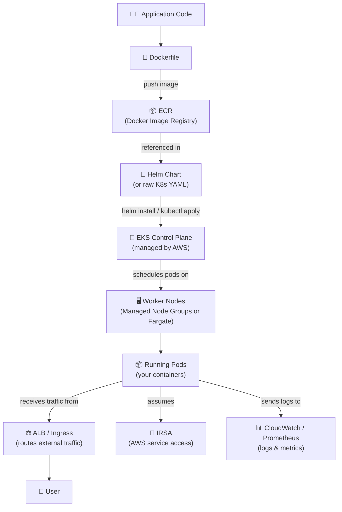

---

## EKS vs. ECS — When to Use Which

| | ECS | EKS |
|---|---|---|
| **Complexity** | Lower — AWS-native, simpler API | Higher — full Kubernetes |
| **Portability** | AWS-only | Runs anywhere K8s runs |
| **Ecosystem** | AWS tooling | Huge K8s ecosystem (Helm, Argo, etc.) |
| **Learning curve** | Gentle | Steeper |
| **Best for** | AWS-first teams, simpler workloads | K8s-experienced teams, multi-cloud, large orgs |

> If you're starting fresh on AWS and don't have a Kubernetes requirement, **ECS + Fargate is simpler**. Choose EKS when portability, the K8s ecosystem, or org standards require it.

---

## Quick Reference

| Concept | One-liner |
|---|---|
| **Cluster** | The full K8s environment — control plane + worker nodes |
| **Control Plane** | The K8s brain — managed by AWS in EKS |
| **Node** | A worker machine (EC2) that runs pods |
| **Pod** | Smallest deployable unit — one or more containers |
| **Deployment** | Declares desired pod count and manages rolling updates |
| **ReplicaSet** | Ensures N pods are always running (managed by Deployment) |
| **K8s Service** | Stable network endpoint that routes traffic to pods |
| **Ingress** | HTTP routing rules for external traffic (pairs with ALB) |
| **Namespace** | Virtual cluster for isolating resources between teams/envs |
| **eksctl** | CLI to create and manage EKS clusters |
| **kubectl** | CLI to deploy and manage workloads on K8s |
| **Managed Node Group** | AWS-managed EC2 worker nodes — recommended default |
| **Fargate Profile** | Serverless pods — no nodes to manage, matched by namespace/labels |
| **IRSA** | IAM Roles for Service Accounts — grants pods AWS permissions |
| **ECR** | AWS's private Docker image registry |
| **Helm** | K8s package manager — charts bundle deployable app configs |

---

###### Resources:
- AWS EKS Official Docs: https://docs.aws.amazon.com/eks/latest/userguide/what-is-eks.html
- eksctl Docs: https://eksctl.io/
- Helm Docs: https://helm.sh/docs/
