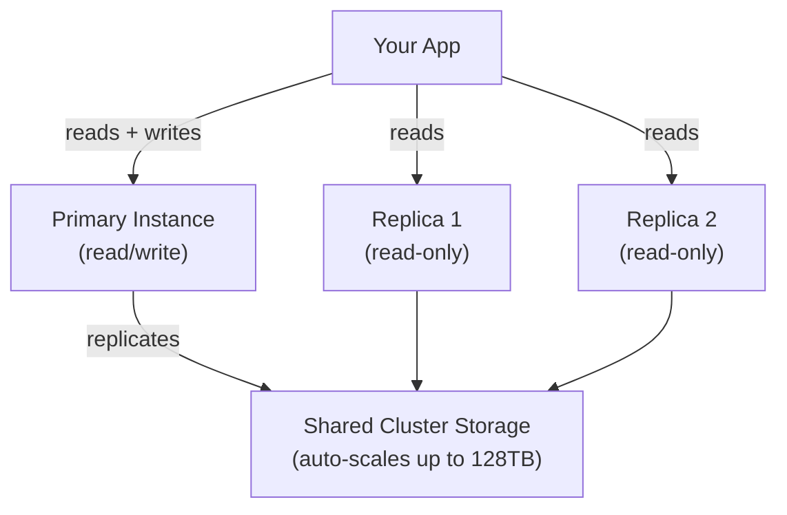
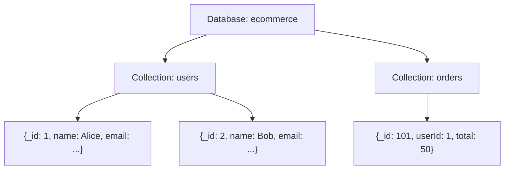
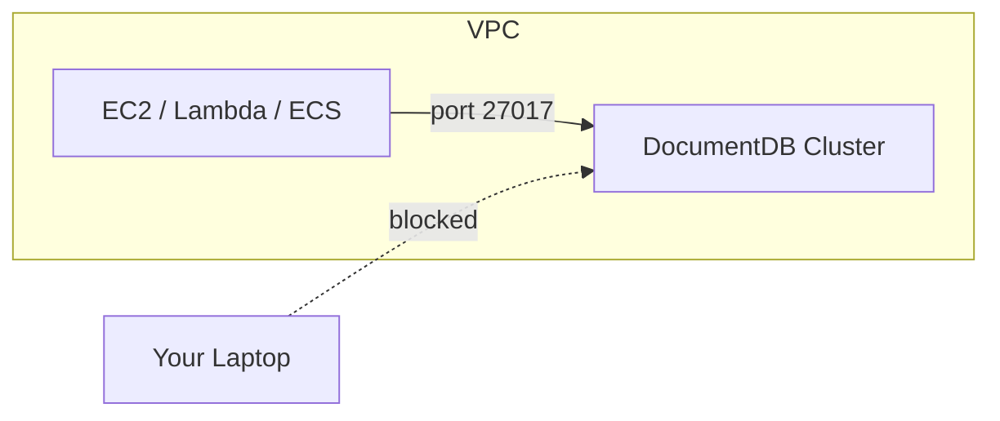

# DocumentDB

AWS's managed document database — MongoDB-compatible, built for JSON workloads. Runs in your VPC, scales storage automatically, handles replication for you.

---

## 1. DocumentDB vs. DynamoDB — Which One?

| | DocumentDB | DynamoDB |
|--|------------|----------|
| **Data model** | JSON documents, nested/rich structure | Key-value / flat documents |
| **Query style** | MongoDB-style queries, filters, aggregations | Query by PK/SK only |
| **Schema** | Flexible, but query-friendly | Flexible |
| **Best for** | MongoDB migrations, complex JSON queries | Simple lookups, extreme scale, serverless |
| **Joins** | No, but supports nested documents | No |

**Choose DocumentDB when:**
- You're migrating an existing MongoDB app to AWS
- Your data is deeply nested JSON and you need rich querying (filters, projections, aggregations)
- You want MongoDB-compatible drivers without managing your own MongoDB cluster

**Choose DynamoDB when:**
- You need single-digit millisecond latency at massive scale
- Access patterns are simple and predictable
- You want fully serverless, zero-ops

---

## 2. Clusters and Replica Instances

DocumentDB runs as a **cluster** — one primary instance that handles writes, and up to 15 read replicas.



- **Primary** — handles all writes; you can also read from it
- **Replicas** — read-only; add them to scale read traffic and increase availability
- **Storage** — shared across all instances, replicated 6 ways across 3 AZs automatically
- **Failover** — if the primary fails, a replica is promoted automatically (typically < 30 seconds)

> You don't manage storage sizing — it grows in 10GB increments as needed.

---

## 3. Collections, Documents, and Indexes

DocumentDB uses the same concepts as MongoDB:

| Term | Meaning |
|------|---------|
| **Database** | A namespace containing collections |
| **Collection** | A group of documents (like a table) |
| **Document** | A single JSON record (like a row) |
| **Index** | Speeds up queries on a specific field |



**Documents are schema-flexible** — no need to define fields upfront. Each document in a collection can have different fields.

**Indexes** — without them, every query scans the whole collection. Always index fields you query on:
```js
// MongoDB shell syntax (also works via pymongo)
db.users.createIndex({ email: 1 })   // ascending index on email
db.orders.createIndex({ userId: 1, createdAt: -1 })  // compound index
```

---

## 4. Connecting with pymongo

DocumentDB is MongoDB-compatible, so you use the standard `pymongo` driver — no special AWS SDK needed.

```bash
pip install pymongo
```

You must download the AWS TLS certificate to connect securely:
```bash
wget https://truststore.pki.rds.amazonaws.com/global/global-bundle.pem
```

```python
import pymongo

client = pymongo.MongoClient(
    host="your-cluster.cluster-xxxx.us-east-1.docdb.amazonaws.com",
    port=27017,
    username="your-username",
    password="your-password",
    tls=True,
    tlsCAFile="global-bundle.pem",
    retryWrites=False   # required for DocumentDB
)

db = client["ecommerce"]
users = db["users"]

# Insert a document
users.insert_one({"name": "Alice", "email": "alice@example.com", "age": 30})

# Find documents
result = users.find({"age": {"$gte": 25}})
for doc in result:
    print(doc)

# Update a document
users.update_one({"name": "Alice"}, {"$set": {"age": 31}})

# Delete a document
users.delete_one({"name": "Alice"})
```

> `retryWrites=False` is required — DocumentDB does not support MongoDB's retryable writes protocol.

---

## 5. VPC-Only Access

DocumentDB has **no public endpoint**. You cannot connect to it from your laptop directly — it only accepts connections from within the same VPC.



**To connect from your local machine**, you have two options:

1. **SSH tunnel through a bastion host (EC2)**
   ```bash
   ssh -L 27017:your-cluster.xxxx.docdb.amazonaws.com:27017 ec2-user@bastion-ip -N
   # Then connect pymongo to localhost:27017
   ```

2. **AWS Systems Manager Session Manager** — port forwarding without opening SSH ports

> Always place DocumentDB in **private subnets**. Make sure your app's security group is allowed inbound on port `27017` in the DocumentDB's security group.

---

###### Resources
- [AWS DocumentDB Docs](https://docs.aws.amazon.com/documentdb/)
- [pymongo Documentation](https://pymongo.readthedocs.io/)
- [DocumentDB vs MongoDB compatibility](https://docs.aws.amazon.com/documentdb/latest/developerguide/mongo-apis.html)
