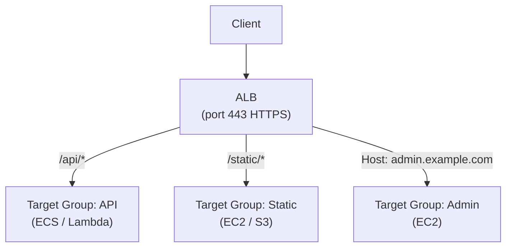
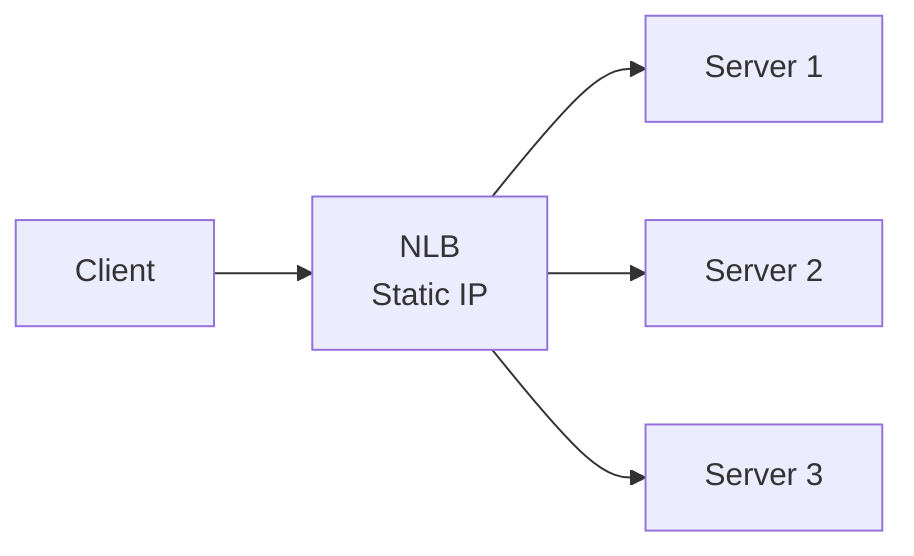
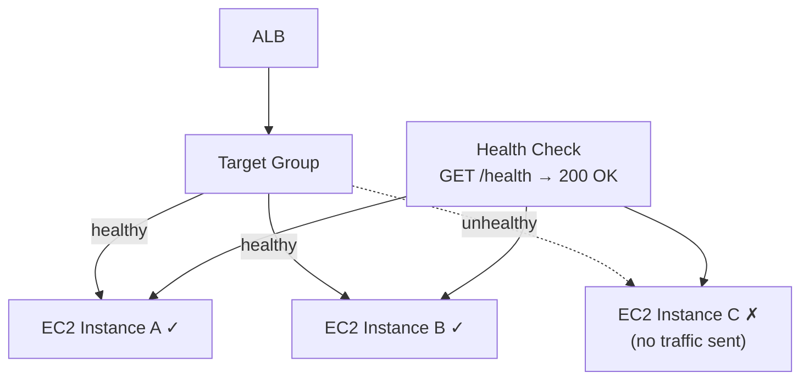
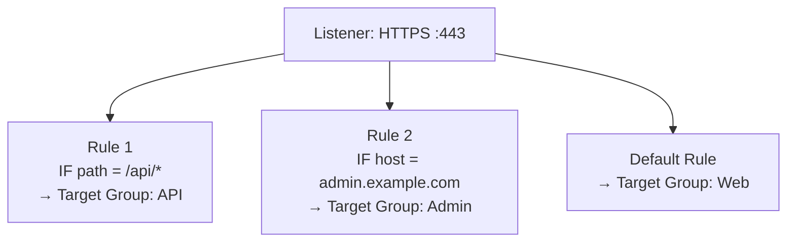
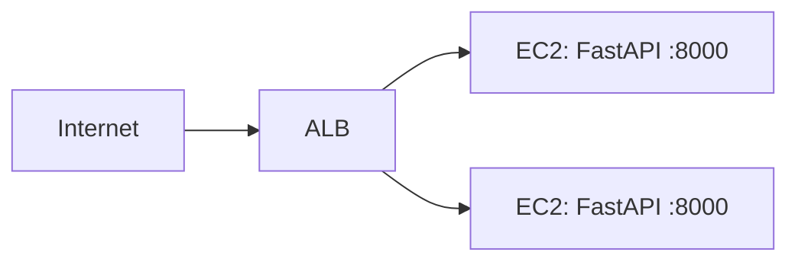
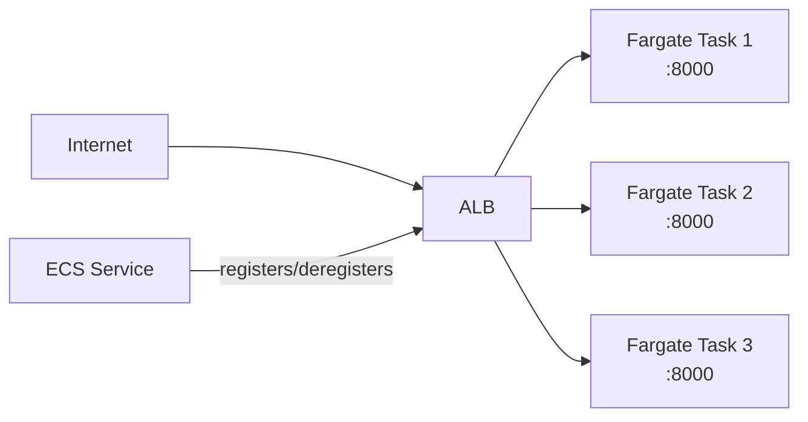
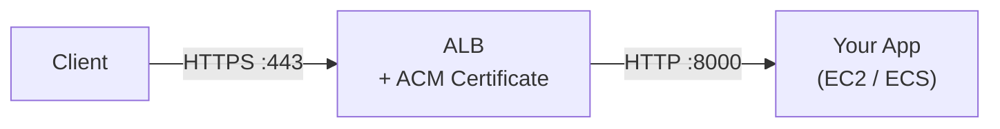

# Load Balancers

Distribute incoming traffic across multiple targets so no single server gets overwhelmed. If one target goes down, the load balancer stops sending traffic to it automatically.

AWS has two load balancers you'll actually use:
- **ALB** (Application Load Balancer) — for HTTP/HTTPS traffic
- **NLB** (Network Load Balancer) — for TCP/UDP traffic, extreme performance

---

## 1. ALB vs. NLB — Which One?

| | ALB | NLB |
|--|-----|-----|
| **Protocol** | HTTP / HTTPS | TCP / UDP / TLS |
| **Routing** | By path, hostname, headers, query params | By IP + port only |
| **Performance** | Fast (milliseconds) | Ultra-fast (microseconds), static IPs |
| **SSL termination** | Yes | Yes (TLS passthrough also possible) |
| **Best for** | Web apps, APIs, microservices | Gaming, IoT, financial apps, anything needing static IPs |

**Default choice: ALB.** Use NLB only when you need static IPs, TCP-level routing, or extreme low latency.

---

## 2. Application Load Balancer (ALB)

ALB operates at Layer 7 (HTTP). It reads the request — the path, hostname, headers — and routes it to the right target.

**Key features:**
- Route `/api/*` to one service, `/static/*` to another — all on the same load balancer
- Route by hostname — `api.example.com` vs `admin.example.com`
- HTTPS termination — the ALB handles TLS, your app receives plain HTTP internally
- Supports EC2, ECS, Lambda, and IP addresses as targets

---

## 3. Network Load Balancer (NLB)

NLB operates at Layer 4 (TCP/UDP). It doesn't read the request content — it just forwards packets. This makes it extremely fast.

**Key features:**
- Static IP addresses (one per AZ) — useful when clients need to whitelist IPs
- Handles millions of requests per second with microsecond latency
- No content-based routing — forwards by connection, not request

---

## 4. Target Groups and Health Checks

A **target group** is the set of servers (targets) the load balancer sends traffic to. You always route to a target group, never directly to an instance.

**Target types:**
- `instance` — EC2 instances by instance ID
- `ip` — IP addresses (ECS Fargate tasks use this)
- `lambda` — a single Lambda function

**Health checks** — the load balancer pings each target periodically. If a target fails health checks, it stops receiving traffic until it recovers.

**Health check settings you care about:**
| Setting | What it does |
|---------|-------------|
| **Path** | Which endpoint to ping (e.g. `/health`) |
| **Interval** | How often to check (default: 30s) |
| **Healthy threshold** | Consecutive successes before marking healthy |
| **Unhealthy threshold** | Consecutive failures before marking unhealthy |

> Always expose a `/health` endpoint in your app that returns `200 OK`. Keep it lightweight — no DB calls.

---

## 5. Listeners and Rules

A **listener** watches for incoming connections on a port (e.g. port 443). **Rules** decide where to send the traffic.

Rules are evaluated top to bottom. The first matching rule wins. The **default rule** catches everything that didn't match.

**Common rule conditions:**
- `path-pattern` — `/api/*`, `/v2/*`
- `host-header` — `api.example.com`
- `http-header` — custom headers
- `query-string` — `?version=2`

**Common rule actions:**
- `forward` — send to a target group
- `redirect` — e.g. HTTP → HTTPS redirect
- `fixed-response` — return a static response (e.g. 404 with a message)

---

## 6. ALB + EC2 / ECS Integration

### With EC2

Register EC2 instances in the target group. The ALB sends traffic to them on the configured port (e.g. 8000 for a FastAPI app).

Security group rule required: allow inbound on port `8000` **from the ALB's security group** (not from the internet directly).

### With ECS Fargate

ECS registers task IPs directly in the target group (target type: `ip`). When ECS scales up/down, it automatically adds/removes targets.

> In your ECS task definition, set the container port. In the ECS service config, point it at your ALB target group — ECS handles the registration automatically.

---

## 7. SSL Termination via ACM

Attach a free TLS certificate from ACM to your ALB listener. The ALB terminates HTTPS — your app only ever sees HTTP internally.

**Setup:**
1. Request a certificate in ACM for your domain (e.g. `api.example.com`)
2. Validate it via DNS (add a CNAME record in Route 53 — one click if your domain is in Route 53)
3. On your ALB, create an HTTPS listener on port 443 and attach the ACM certificate
4. Add a second listener on port 80 with a redirect rule → HTTPS

> ACM certificates auto-renew. You never need to manually rotate them.

---

###### Resources
- [Cloudflare — What is Load Balancing?](https://www.cloudflare.com/learning/performance/what-is-load-balancing/)
- [ALB User Guide — AWS Docs](https://docs.aws.amazon.com/elasticloadbalancing/latest/application/introduction.html)
- [NLB User Guide — AWS Docs](https://docs.aws.amazon.com/elasticloadbalancing/latest/network/introduction.html)
- [ALB Listener Rules — AWS Docs](https://docs.aws.amazon.com/elasticloadbalancing/latest/application/listener-update-rules.html)
