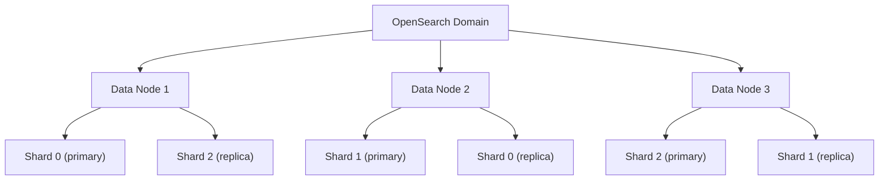
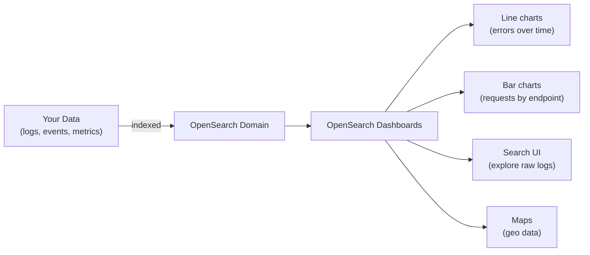
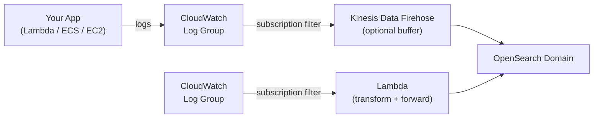

# OpenSearch

AWS's managed search and analytics engine — a fork of Elasticsearch. Best for full-text search, log analytics, and visualisation dashboards. Not a primary database — it's a search layer you put on top of your data.

**When to use it:** Full-text search (product search, document search), log analysis, real-time dashboards.
**When NOT to use it:** Primary data storage, simple key-value lookups, relational queries → use RDS/DynamoDB instead.

---

## 1. When to Use OpenSearch

| Use Case | Why OpenSearch |
|----------|---------------|
| **Full-text search** | Relevance ranking, fuzzy matching, partial words — things SQL `LIKE` can't do well |
| **Log analysis** | Ingest millions of log lines, filter and aggregate in near real-time |
| **Dashboards** | Visualise metrics, error rates, trends with OpenSearch Dashboards |
| **Autocomplete / typeahead** | Fast prefix and fuzzy search on large datasets |

> OpenSearch does not replace your primary database. Your source of truth stays in RDS/DynamoDB — you sync data into OpenSearch to make it searchable.

---

## 2. Domains, Nodes, and Shards

### Domain
An OpenSearch **domain** is your managed cluster — it's the resource you create in AWS. One domain = one cluster with its own endpoint.

### Nodes
A cluster is made up of **nodes** (EC2 instances managed by AWS):

| Node Type | Role |
|-----------|------|
| **Data nodes** | Store data and handle search queries |
| **Master nodes** | Manage cluster state (index creation, node joins). Dedicated master nodes recommended for production. |
| **UltraWarm nodes** | Cheaper storage for older, less-queried data (S3-backed) |

### Shards
OpenSearch splits each index into **shards** — smaller chunks distributed across nodes. This is what enables parallel search at scale.



- Primary shards hold the data. Replica shards are copies for redundancy + read scaling.
- Shard count is set at index creation and **cannot be changed** — plan ahead.
- Rule of thumb: keep shards between **10–50GB** each.

---

## 3. Indexing and Querying via the REST API

OpenSearch exposes a REST API. Everything — creating indexes, inserting documents, running searches — is an HTTP request.

### Index a Document (PUT / POST)

```bash
# Index a single document with a specific ID
PUT https://your-domain.us-east-1.es.amazonaws.com/products/_doc/1
Content-Type: application/json

{
  "name": "Wireless Headphones",
  "brand": "Sony",
  "price": 299,
  "description": "Noise cancelling over-ear headphones"
}
```

```bash
# Bulk index (efficient for large datasets)
POST https://your-domain.../products/_bulk

{ "index": { "_id": "2" } }
{ "name": "Laptop Stand", "brand": "Rain", "price": 49 }
{ "index": { "_id": "3" } }
{ "name": "USB-C Hub", "brand": "Anker", "price": 35 }
```

### Search Documents

```bash
# Full-text search across all fields
GET https://your-domain.../products/_search

{
  "query": {
    "match": {
      "description": "noise cancelling"
    }
  }
}
```

```bash
# Filter by exact value + full-text search combined
GET https://your-domain.../products/_search

{
  "query": {
    "bool": {
      "must": { "match": { "description": "headphones" } },
      "filter": { "range": { "price": { "lte": 300 } } }
    }
  }
}
```

### From Python (opensearch-py)

```bash
pip install opensearch-py requests-aws4auth
```

```python
from opensearchpy import OpenSearch, RequestsHttpConnection
from requests_aws4auth import AWS4Auth
import boto3

region = "us-east-1"
service = "es"
credentials = boto3.Session().get_credentials()
awsauth = AWS4Auth(credentials.access_key, credentials.secret_key, region, service, session_token=credentials.token)

client = OpenSearch(
    hosts=[{"host": "your-domain.us-east-1.es.amazonaws.com", "port": 443}],
    http_auth=awsauth,
    use_ssl=True,
    connection_class=RequestsHttpConnection
)

# Index a document
client.index(index="products", id="1", body={"name": "Headphones", "price": 299})

# Search
response = client.search(index="products", body={"query": {"match": {"name": "headphones"}}})
print(response["hits"]["hits"])
```

---

## 4. OpenSearch Dashboards

OpenSearch Dashboards (formerly Kibana) is a web UI built into every OpenSearch domain. Access it at:
```
https://your-domain.us-east-1.es.amazonaws.com/_dashboards
```



**Key features:**
- **Discover** — explore raw documents, filter by field, search free text
- **Visualise** — build charts from aggregated queries
- **Dashboard** — combine multiple visualisations into one view
- **Dev Tools** — run REST API queries directly from the browser (great for development)

> For production, restrict Dashboards access. Put it behind a VPN or use fine-grained access control (FGAC).

---

## 5. Ingesting CloudWatch Logs via Subscription Filters

The most common AWS pattern: send CloudWatch log groups to OpenSearch for searching and dashboards.



**Two ingestion paths:**

### Option A — CloudWatch → Firehose → OpenSearch (recommended)
1. Create a Kinesis Data Firehose delivery stream with OpenSearch as destination
2. In CloudWatch, create a **subscription filter** on your log group pointing to the Firehose stream
3. Firehose buffers and batches log records before writing to OpenSearch

### Option B — CloudWatch → Lambda → OpenSearch
1. Create a Lambda that receives log events and writes to OpenSearch via the REST API
2. Add a **subscription filter** on the log group to trigger the Lambda

> Option A is simpler and cheaper at scale. Use Option B when you need custom log transformation before indexing.

**Creating a subscription filter (CLI):**
```bash
aws logs put-subscription-filter \
  --log-group-name "/aws/lambda/my-function" \
  --filter-name "all-logs" \
  --filter-pattern "" \
  --destination-arn arn:aws:firehose:us-east-1:123456789:deliverystream/my-stream
```

---

###### Resources
- [My prev docs](https://docs.google.com/document/d/1fkfglTGi_7OPPw36zvTqAcII9W_gudhk5sZ0-yde0Qc/edit?usp=sharing)
- [OpenSearch Service Developer Guide — AWS Docs](https://docs.aws.amazon.com/opensearch-service/latest/developerguide/what-is.html)
- [OpenSearch REST API Reference](https://opensearch.org/docs/latest/api-reference/)
- [Sending CloudWatch Logs to OpenSearch — AWS Docs](https://docs.aws.amazon.com/AmazonCloudWatch/latest/logs/CWL_OpenSearch_Stream.html)
