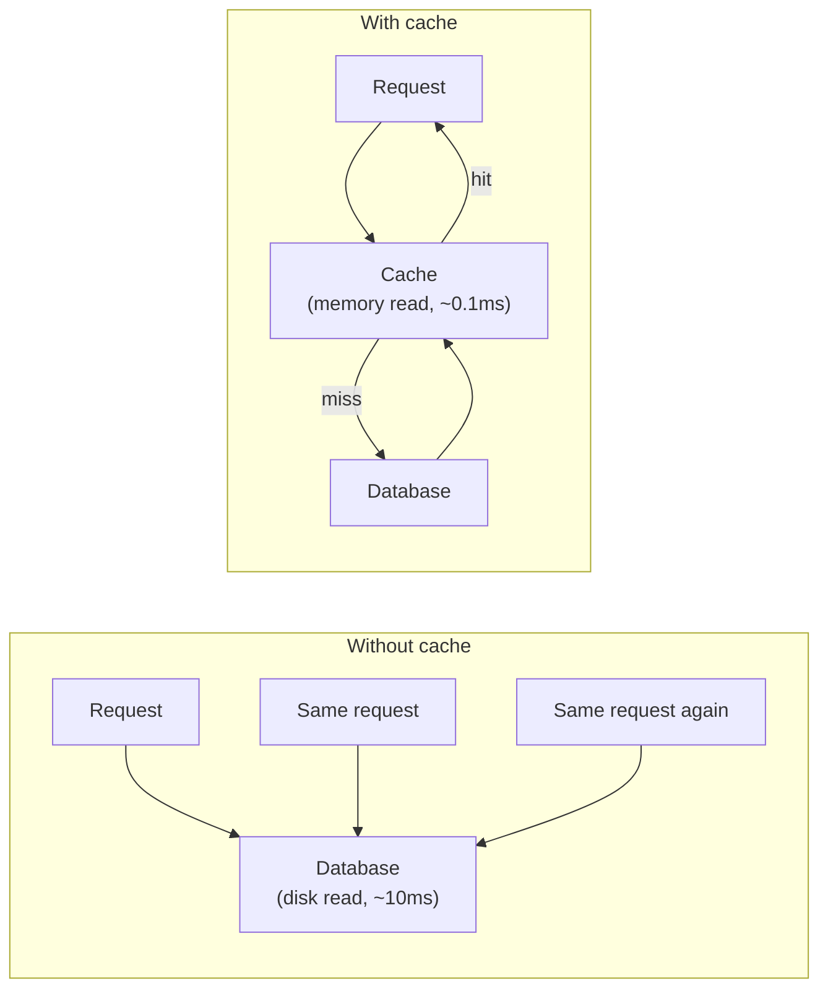
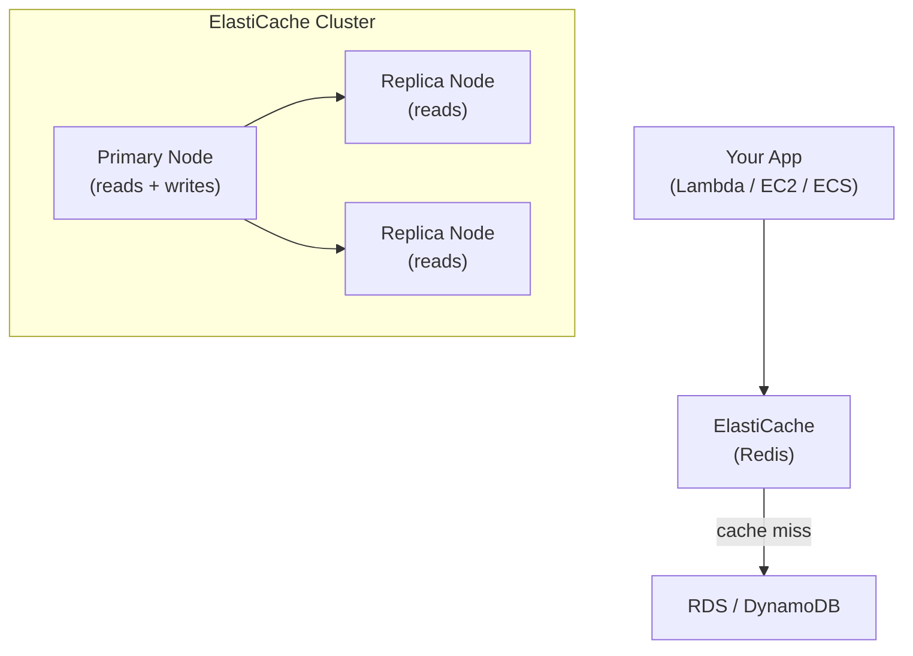
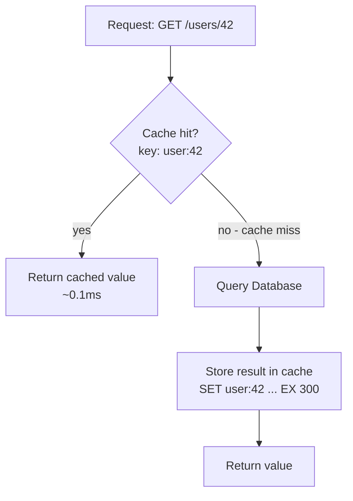
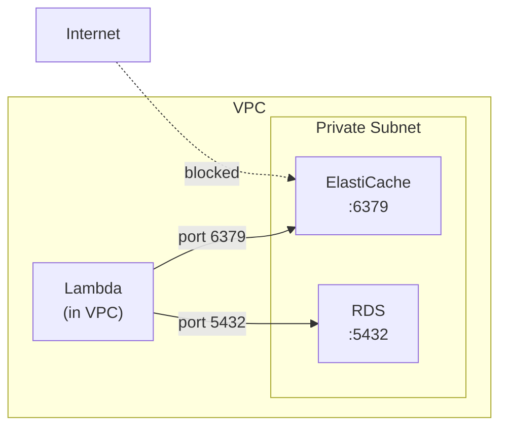

# ElastiCache & Redis

A cache is an in-memory data store that sits in front of your database. Reads from memory are orders of magnitude faster than reads from disk. Redis is the most popular cache — ElastiCache is AWS's managed Redis service.

---

## 1. Why Caching Exists

Every DB read takes time — a network round trip + disk I/O. Under load, repeated identical queries waste both time and DB capacity.



**What caching gives you:**
- Faster responses — sub-millisecond reads from memory vs. milliseconds from DB
- Less DB load — popular queries hit the cache, not the DB
- Lower cost — fewer DB reads = less RCU spend (DynamoDB) or less DB CPU (RDS)

---

## 2. Redis — What It Is

Redis is an in-memory key-value store. It's not just a cache — it supports rich data structures.

| Data Type | Example Use |
|-----------|-------------|
| `String` | Cache a serialised JSON response |
| `Hash` | Store a user object by field |
| `List` | Recent activity feed |
| `Set` | Unique visitors, tags |
| `Sorted Set` | Leaderboard, rate limiting |
| `TTL on any key` | Auto-expire cached data |

Keys are strings. Values can be any of the above. Everything lives in RAM — so it's fast but not a replacement for a persistent DB.

---

## 3. ElastiCache — Managed Redis on AWS

ElastiCache is Redis running on AWS-managed infrastructure. You don't install, patch, or manage Redis — AWS handles it.



**Key concepts:**
- **Cluster** — one or more nodes running Redis
- **Primary node** — handles writes; replicas handle reads
- **Replication group** — primary + replicas with automatic failover
- **Subnet group** — which VPC subnets ElastiCache lives in (always private subnets)

> ElastiCache lives inside your VPC with no public endpoint — same constraint as RDS. Your app must be in the same VPC to connect.

---

## 4. Cache-Aside Pattern

The most common caching pattern. Your app is responsible for reading from and writing to the cache.



**In code (Python + redis-py):**

```python
import redis
import json

r = redis.Redis(host="your-cluster.xxxx.cache.amazonaws.com", port=6379, ssl=True)

def get_user(user_id: str):
    cache_key = f"user:{user_id}"

    # 1. Check cache
    cached = r.get(cache_key)
    if cached:
        return json.loads(cached)  # cache hit

    # 2. Cache miss — fetch from DB
    user = db.query(User).filter(User.id == user_id).first()

    # 3. Populate cache with a 5-minute TTL
    r.set(cache_key, json.dumps(user.dict()), ex=300)

    return user
```

---

## 5. TTL and Cache Invalidation

### TTL (Time-to-Live)
Every key can have a TTL — Redis deletes it automatically when it expires.

```python
r.set("user:42", value, ex=300)    # expires in 300 seconds (5 min)
r.set("session:abc", value, ex=3600)  # expires in 1 hour
r.set("config", value)             # no TTL — lives forever until deleted
```

Set TTLs based on how stale your data can tolerate being:
| Data | Suggested TTL |
|------|--------------|
| User profile | 5–15 minutes |
| Product catalogue | 1–24 hours |
| Session token | Match session expiry |
| Real-time data | Don't cache, or very short (seconds) |

### Cache Invalidation
When data changes in your DB, the cached version is stale. Two strategies:

**1. Delete on write** — when you update a user, delete `user:42` from cache. Next read will re-populate it.
```python
def update_user(user_id, data):
    db.update(user_id, data)
    r.delete(f"user:{user_id}")  # invalidate cache
```

**2. Rely on TTL** — do nothing on write. Accept that reads may be slightly stale until the TTL expires. Simpler, fine for non-critical data.

> Cache invalidation is one of the hardest problems in software. When in doubt, use short TTLs and delete on write.

---

## 6. Connecting Lambda to ElastiCache (VPC Considerations)

ElastiCache has no public endpoint — it only accepts connections from within its VPC. Lambda must be in the same VPC.



**Setup steps:**
1. Place Lambda in the same VPC as ElastiCache (Lambda → Configuration → VPC)
2. Create a security group for Lambda (`sg-lambda`) and for ElastiCache (`sg-redis`)
3. In `sg-redis`: allow inbound on port `6379` from `sg-lambda`

**Connection in Lambda (important — reuse the connection across invocations):**

```python
import redis
import os

# Initialise OUTSIDE the handler — reused across warm invocations
r = redis.Redis(
    host=os.getenv("REDIS_HOST"),  # your-cluster.xxxx.cache.amazonaws.com
    port=6379,
    ssl=True,
    decode_responses=True
)

def handler(event, context):
    value = r.get("some-key")
    return {"value": value}
```

> Initialising the Redis client inside the handler creates a new connection on every invocation. Put it at module level so warm Lambda instances reuse the same connection.

**One more issue — Lambda cold starts in a VPC are slower.** Attaching Lambda to a VPC adds ~500ms on cold starts (though this has improved significantly with newer Lambda VPC improvements). Only attach Lambda to a VPC when it needs to reach VPC resources like ElastiCache or RDS.

---

## 7. When NOT to Cache

Caching adds complexity. Don't reach for it automatically.

| Situation | Why not to cache |
|-----------|-----------------|
| **Data changes constantly** | TTL expires faster than it helps; stale reads cause bugs |
| **Queries are already fast** | If your DB query is <5ms, caching adds complexity for little gain |
| **Data is user-specific and rarely repeated** | Cache hit rate will be near zero — you're just wasting memory |
| **Strong consistency is required** | Cache can serve stale data — if that's never acceptable, skip it |
| **Low traffic** | At low request rates, DB handles it fine; cache is premature optimisation |

> Add caching when you can measure the problem it solves — high DB CPU, slow response times, repeated identical queries. Don't add it speculatively.

---

###### Resources
- [Redis intro — YouTube](https://www.youtube.com/watch?v=Tqaqdfxi-J4)
- [Elasticache with EC2 - YT](https://youtu.be/Q1WQqxwsIMk?si=b8C3Pm1FwdgLFxDX)
- [ElastiCache for Redis Developer Guide — AWS Docs](https://docs.aws.amazon.com/AmazonElastiCache/latest/red-ug/WhatIs.html)
- [Caching Strategies — AWS Docs](https://docs.aws.amazon.com/AmazonElastiCache/latest/red-ug/Strategies.html)
- [Lambda + ElastiCache — AWS Blog](https://aws.amazon.com/blogs/compute/using-amazon-elasticache-for-redis-as-a-cache-for-amazon-dynamodb/)
