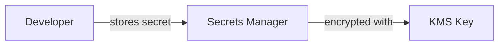
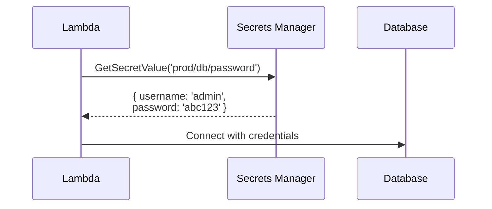
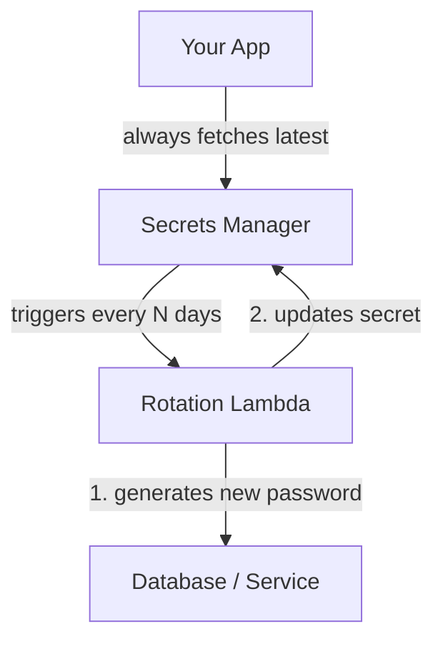

# Secrets Manager

AWS service to securely store and access secrets (passwords, API keys, tokens — anything you'd normally put in a `.env` file).

---

## Storing Secrets

Secrets Manager can store:
- **DB credentials** — username/password for RDS, Aurora, etc.
- **API keys** — third-party service keys
- **Tokens** — OAuth tokens, JWT signing keys, etc.

Each secret is stored as a key/value pair (or plain text) and encrypted at rest using KMS.



---

## Fetching Secrets from Lambda at Runtime

Instead of hardcoding secrets in env vars or code, Lambda fetches them at runtime.



**Python example:**

```python
import boto3, json

def get_secret(secret_name):
    client = boto3.client('secretsmanager')
    response = client.get_secret_value(SecretId=secret_name)
    return json.loads(response['SecretString'])

def handler(event, context):
    secret = get_secret('prod/myapp/db')
    # use secret['username'], secret['password']
```

> **Tip:** Cache the secret in memory (outside the handler) to avoid fetching on every invocation.

---

## Automatic Secret Rotation

Secrets should change periodically for security. Doing it manually means updating both the secret in Secrets Manager **and** the actual database — easy to forget or get out of sync. Automatic rotation handles both steps on a schedule.



- A **Lambda function** does the actual rotation (AWS provides ready-made templates for RDS, Redshift, etc.)
- You set the interval (e.g., every 30 days)
- Your app is unaffected — it always fetches the latest secret at runtime, so rotation is transparent to your code

---

## Secrets Manager vs. SSM Parameter Store

| | Secrets Manager | SSM Parameter Store |
|---|---|---|
| **Cost** | ~$0.40/secret/month | Free (Standard tier) |
| **Auto rotation** | Yes, built-in | No (manual) |
| **Best for** | Passwords, credentials | Config values, feature flags |
| **Encryption** | Always KMS | Optional (SecureString tier) |
| **Cross-account access** | Yes | Limited |
| **Secret versioning** | Yes | Yes |

**Rule of thumb:**
- Use **Secrets Manager** for anything that rotates or is highly sensitive (DB passwords, API keys)
- Use **SSM Parameter Store** for app config and non-sensitive settings (URLs, feature flags)

---

##### Resources:

- [**AWS Secrets manager with Lambda**](https://www.youtube.com/watch?v=pt9nAS4PVBI)
- [AWS Secrets Manager Docs](https://docs.aws.amazon.com/secretsmanager/latest/userguide/intro.html)
- [Lambda + Secrets Manager tutorial](https://docs.aws.amazon.com/secretsmanager/latest/userguide/retrieving-secrets_lambda.html)
