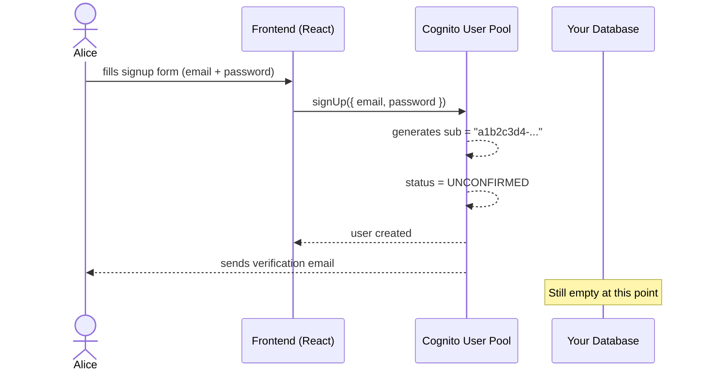
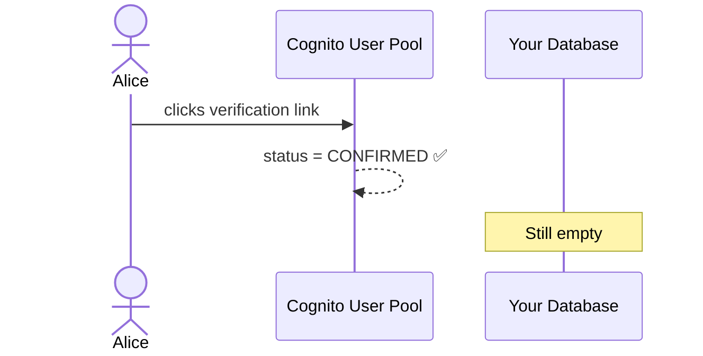
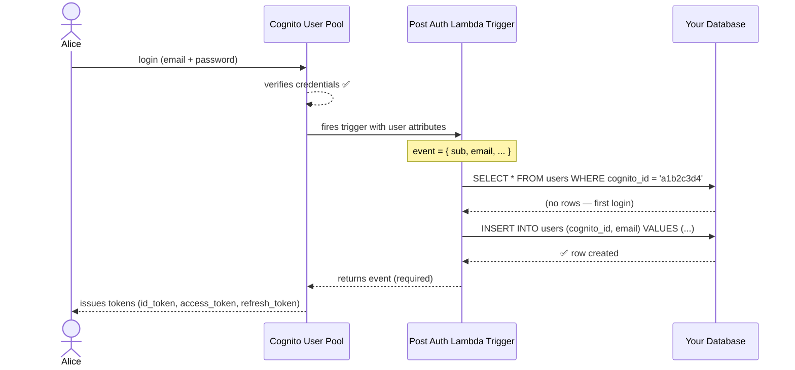
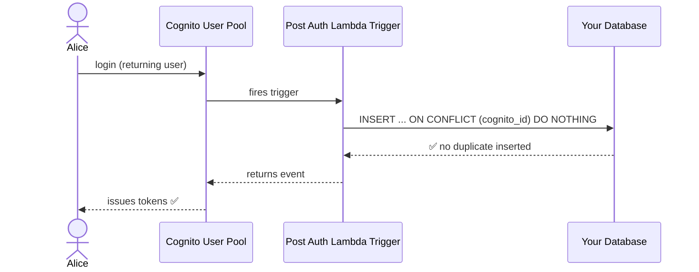
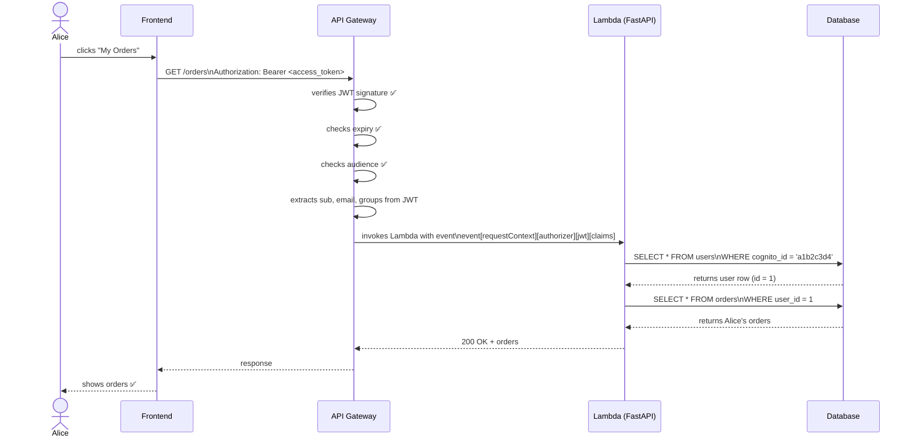
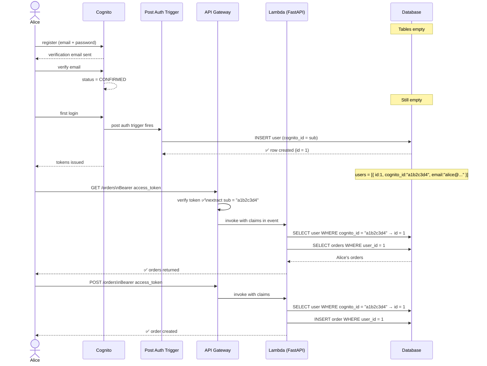
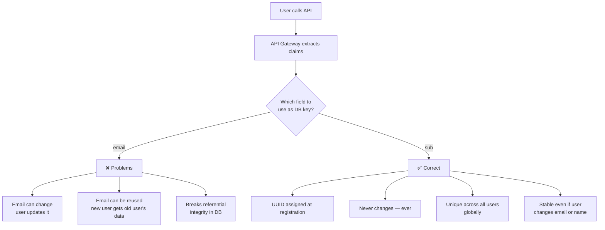

# AWS Cognito + Database Integration
## From Empty Database to Authenticated User

---

## Table of Contents

1. [Core Concept](#core-concept)
2. [Phase 1 — Application Start (Empty Database)](#phase-1--application-start-empty-database)
3. [Phase 2 — First User Registers](#phase-2--first-user-registers)
4. [Phase 3 — Email Verified](#phase-3--email-verified)
5. [Phase 4 — First Login → DB Record Created](#phase-4--first-login--db-record-created)
6. [Phase 5 — Every Subsequent API Call](#phase-5--every-subsequent-api-call)
7. [Complete Journey](#complete-journey)
8. [Why `sub` and not Email](#why-sub-and-not-email)

---

## Core Concept

Cognito and your database are **two separate systems** linked by one shared key — the `sub` (Cognito's UUID for the user).

```
Cognito User Pool              Your Database (RDS / DynamoDB)
──────────────────             ──────────────────────────────
sub:   "a1b2c3-..."  ◄──────►  cognito_id: "a1b2c3-..."
email: "alice@..."             email:       "alice@..."
password: [hashed]             name:        "Alice"
                               created_at:  ...
                               orders:      [...]
```

| System | Owns |
|---|---|
| **Cognito** | Identity — who you are, password, MFA, token issuance |
| **Your DB** | Profile and business data — orders, preferences, etc. |
| **`sub`** | The permanent bridge between both systems |

---

## Phase 1 — Application Start (Empty Database)

You deploy your app. Tables exist but are completely empty.

### Schema

```sql
CREATE TABLE users (
    id          SERIAL PRIMARY KEY,
    cognito_id  VARCHAR(255) UNIQUE NOT NULL,  -- the "sub" from Cognito
    email       VARCHAR(255) UNIQUE NOT NULL,
    name        VARCHAR(255),
    created_at  TIMESTAMP DEFAULT NOW()
);

CREATE TABLE orders (
    id          SERIAL PRIMARY KEY,
    user_id     INTEGER REFERENCES users(id),  -- FK to users.id
    book_name   VARCHAR(255),
    status      VARCHAR(50),
    created_at  TIMESTAMP DEFAULT NOW()
);
```

### Initial State

```
users  → (empty)
orders → (empty)
```

> **Key point:** `cognito_id` is the column that links your DB to Cognito.
> It stores the `sub` value Cognito assigns to every user at registration.

---

## Phase 2 — First User Registers

The user fills in a signup form. The frontend calls Cognito directly (via Amplify SDK).



> Cognito has the user. Your DB does **not** know yet.
> The DB only gets populated on **first login** — this is called **lazy user creation**.

---

## Phase 3 — Email Verified

Alice clicks the verification link in her email.



> Your DB is still empty after email verification.
> It only gets a row when the user **logs in for the first time**.

---

## Phase 4 — First Login → DB Record Created

This is the critical moment where Cognito and your DB get linked.

### Two Ways to Create the DB Record

#### ✅ Recommended — Post Authentication Lambda Trigger

Cognito fires a Lambda function automatically after every successful login.
You use this Lambda to create the DB record on first login.



**What happens on second login:**



**The Trigger Lambda code:**

```python
import psycopg2
import os

def handler(event, context):
    """
    Fires on every successful Cognito login.
    Creates a DB record on first login.
    Safe to call repeatedly — ON CONFLICT DO NOTHING prevents duplicates.
    """
    user_attributes = event["request"]["userAttributes"]

    cognito_id = user_attributes["sub"]
    email      = user_attributes["email"]

    conn = psycopg2.connect(os.environ["DATABASE_URL"])
    cur  = conn.cursor()

    cur.execute("""
        INSERT INTO users (cognito_id, email)
        VALUES (%s, %s)
        ON CONFLICT (cognito_id) DO NOTHING
    """, (cognito_id, email))

    conn.commit()
    cur.close()
    conn.close()

    print(f"User ensured in DB: {cognito_id} / {email}")

    # MUST return the event back to Cognito
    # or the entire login flow breaks
    return event
```

**Setting up the trigger in SAM (`template.yaml`):**

```yaml
Resources:
  CognitoUserPool:
    Type: AWS::Cognito::UserPool
    Properties:
      UserPoolName: bookstore-user-pool
      LambdaConfig:
        PostAuthentication: !GetAtt PostAuthTriggerFunction.Arn
        # ↑ fires this Lambda after every successful login

  PostAuthTriggerFunction:
    Type: AWS::Serverless::Function
    Properties:
      Handler: trigger.handler
      Runtime: python3.11
      Environment:
        Variables:
          DATABASE_URL: !Sub "{{resolve:secretsmanager:prod/db-url}}"
```

**After first login, your DB looks like:**

```
users table:
┌────┬──────────────────────────────────────┬───────────────────┬──────┐
│ id │ cognito_id                           │ email             │ name │
├────┼──────────────────────────────────────┼───────────────────┼──────┤
│ 1  │ a1b2c3d4-e5f6-7890-abcd-ef1234567890 │ alice@example.com │ NULL │
└────┴──────────────────────────────────────┴───────────────────┴──────┘
```

---

#### Alternative — Create Record on First API Call

Instead of a trigger Lambda, the FastAPI app creates the DB record the first time
a user hits any authenticated endpoint. No trigger setup needed, but the DB row
doesn't exist until the user actually calls an API — meaning if you need the user
row to exist before any API call (e.g. for analytics or welcome emails on signup),
this approach won't work. Best used for simpler apps where you don't need the
record to exist immediately after login.

---

## Phase 5 — Every Subsequent API Call

### How API Gateway Passes User Identity to Lambda

After login, every API call carries the `access_token`. API Gateway verifies it
and **injects the decoded claims directly into the Lambda event** — your Lambda
never touches the token itself.



### What the Lambda Event Contains

```python
# The raw event Lambda receives after API Gateway verifies the token
{
    "requestContext": {
        "authorizer": {
            "jwt": {
                "claims": {
                    "sub":              "a1b2c3d4-e5f6-7890-abcd-ef1234567890",
                    "email":            "alice@example.com",
                    "email_verified":   "true",
                    "cognito:username": "alice@example.com",
                    "cognito:groups":   "admin,customer",
                    "exp":              "1710003600",
                    "token_use":        "access",
                }
            }
        }
    }
}
```

### FastAPI Code — Reading User from Event Context

```python
from fastapi import FastAPI, Request, HTTPException
from mangum import Mangum

app = FastAPI()


def get_user_from_event(request: Request) -> dict:
    """
    Reads verified user claims from the Lambda event.
    API Gateway already verified the token — we just read the result.
    No token verification code needed here.
    """
    claims = request.state.aws_event["requestContext"]["authorizer"]["jwt"]["claims"]

    return {
        "user_id": claims["sub"],
        "email":   claims["email"],
        "groups":  claims.get("cognito:groups", "").split(",")
                   if claims.get("cognito:groups") else []
    }


@app.get("/orders")
def get_orders(request: Request, db: Session = Depends(get_db)):

    # Step 1 — get verified identity (no token code needed)
    user_claims = get_user_from_event(request)

    # Step 2 — find user in DB using cognito_id as the link
    user = db.query(User).filter(
        User.cognito_id == user_claims["user_id"]
    ).first()

    # Step 3 — use internal DB id for all queries
    orders = db.query(Order).filter(Order.user_id == user.id).all()

    return {"orders": orders}


@app.delete("/books/{book_id}")
def delete_book(book_id: str, request: Request, db: Session = Depends(get_db)):
    user_claims = get_user_from_event(request)

    # API Gateway verified the token.
    # We still check GROUP membership ourselves —
    # API Gateway verifies identity, not authorization.
    if "admin" not in user_claims["groups"]:
        raise HTTPException(status_code=403, detail="Admins only")

    db.query(Book).filter(Book.id == book_id).delete()
    return {"deleted": book_id}


handler = Mangum(app)
```

---

## Complete Journey



---

## Why `sub` and not Email



**Rule:** Always use `sub` as the foreign key in your database. Never email.

```python
# ❌ Never do this
user = db.query(User).filter(User.email == claims["email"]).first()

# ✅ Always do this
user = db.query(User).filter(User.cognito_id == claims["sub"]).first()
```

---

## Summary

| Phase | What Happens | DB State |
|---|---|---|
| App deployed | Tables created, empty | Empty |
| User registers | Cognito creates user with `sub` | Still empty |
| Email verified | Cognito marks user CONFIRMED | Still empty |
| **First login** | **Trigger Lambda inserts DB row** | **Row created** |
| Every API call | API Gateway verifies token, Lambda reads `sub`, queries DB | Grows with usage |

> **The `sub` is the permanent, unchanging bridge between Cognito and your database.**
> Store it as `cognito_id` in your users table and use it as the lookup key on every authenticated request.
