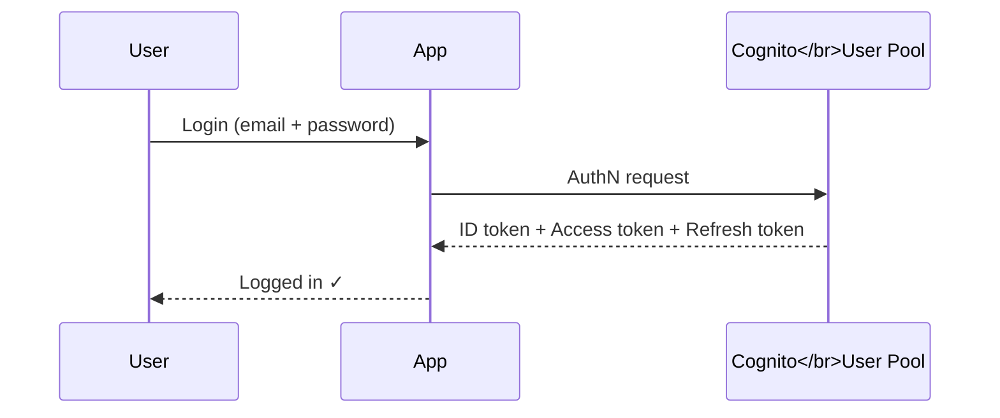
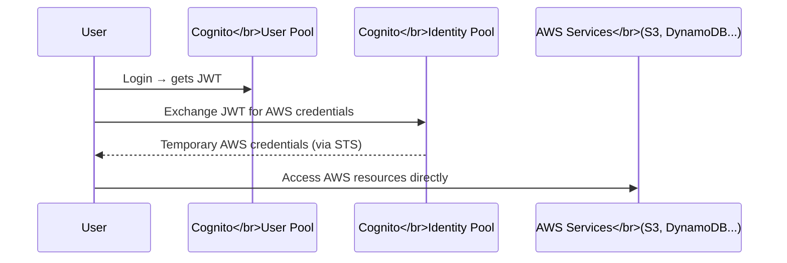
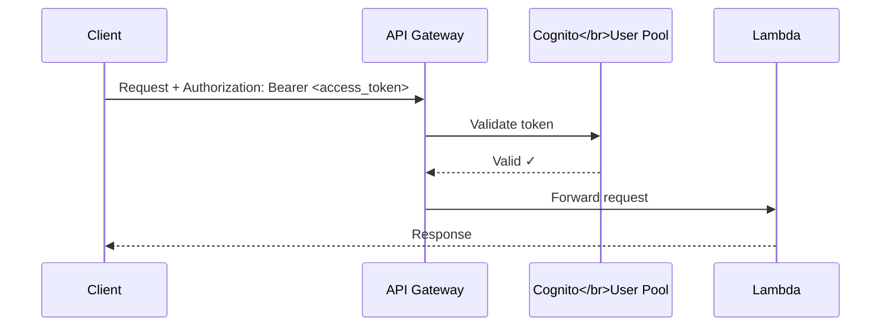
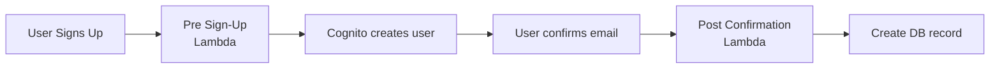

# Cognito

AWS Cognito handles **authentication** (who are you?) and **authorization** (what can you access?) for your apps.

---

## Core Concepts

| Component | Purpose |
|-----------|---------|
| **User Pool** | Authentication — sign up, sign in, JWTs |
| **Identity Pool** | Authorization — grant AWS resource access |

---

## User Pools — Authentication

A User Pool is a directory of users. It handles:
- Sign up / sign in
- Password reset, MFA
- Issues **JWT tokens** after login



---

## JWT Tokens

After login, Cognito returns 3 tokens:

| Token | Contains | Used For |
|-------|----------|----------|
| **ID Token** | User identity (name, email, sub) | Identify the user in your app |
| **Access Token** | Scopes, groups | Authorize API calls |
| **Refresh Token** | Long-lived credential | Get new ID/Access tokens when they expire |

> ID token = *who you are*. Access token = *what you can do*.

---

## Identity Pools — Authorization

Identity Pools swap a JWT (from a User Pool or other IdP) for **temporary AWS credentials** (via STS). This lets users directly access AWS services like S3, DynamoDB, etc.



> Most web/mobile apps only need a **User Pool**. Use an Identity Pool only if users need direct AWS resource access.

---

## Cognito Authorizer in API Gateway

Protect your API endpoints using Cognito without writing auth code.



**Setup steps:**
1. In API Gateway, create a **Cognito authorizer** pointing to your User Pool
2. Attach the authorizer to your routes
3. Clients send the **Access Token** in the `Authorization` header
4. API Gateway validates it automatically — no code needed

---

## Lambda Triggers

Hook into the Cognito auth lifecycle with Lambda functions.

| Trigger | When it fires | Common use |
|---------|--------------|------------|
| **Pre Sign-Up** | Before user is created | Block certain emails/domains |
| **Post Confirmation** | After user confirms email | Create user record in DB |
| **Pre Token Generation** | Before JWT is issued | Add custom claims to token |
| **Post Authentication** | After successful login | Log login events |
| **Custom Message** | Before sending email/SMS | Customize verification emails |



---

## Hosted UI vs. Custom Auth Flow

| | Hosted UI | Custom Auth Flow |
|-|-----------|-----------------|
| **What it is** | Pre-built login page by AWS | You build the UI, call Cognito SDK |
| **Setup time** | Minutes | Hours |
| **Customization** | Limited (CSS only) | Full control |
| **Best for** | Quick prototypes, internal tools | Production apps with branded UI |

**Hosted UI** — Cognito serves the login page at a URL like:
```
https://your-domain.auth.us-east-1.amazoncognito.com/login
```

**Custom flow** — You call Cognito directly from your app:
```python
# Example: sign in with boto3
client.initiate_auth(
    AuthFlow="USER_PASSWORD_AUTH",
    AuthParameters={"USERNAME": email, "PASSWORD": password},
    ClientId=CLIENT_ID,
)
```

---

##### Resources:
- [Beginners guide](https://youtu.be/QEGo6ZoN-ao?si=G3cnMy6u2adTCh8s)
- [Securing APIGateway with Cognito](https://www.youtube.com/watch?v=oFSU6rhFETk)
