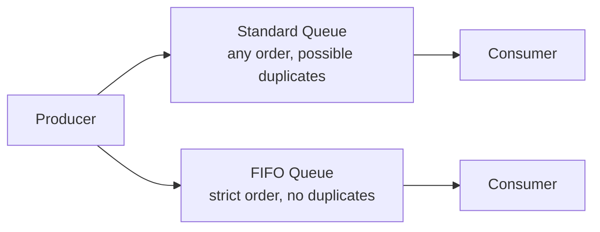
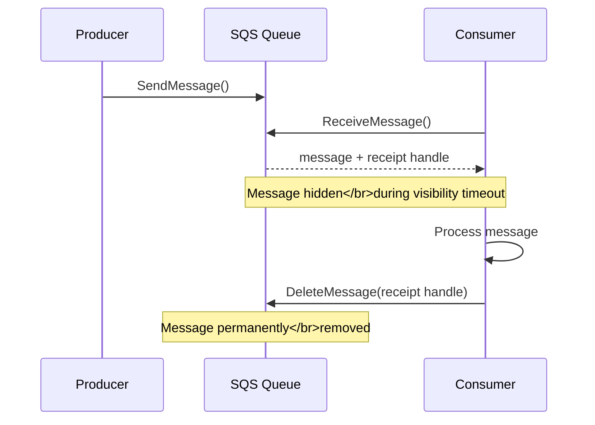
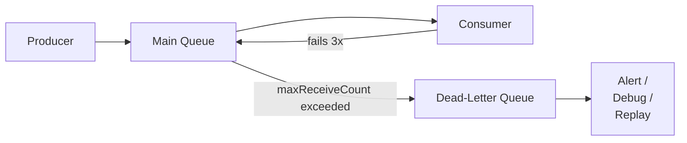
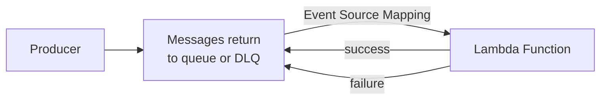
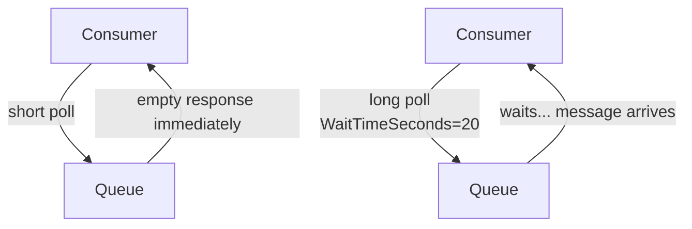

# Simple Queue Service (SQS)

SQS is a managed message queue. Producers send messages, consumers read and process them. The queue decouples the two sides so they don't need to talk directly.

---

##### Resources:

- [SQS overview](https://youtu.be/CyYZ3adwboc?si=IPtVx_kb5eoP-TmL)
- [SQS walkthrough](https://youtu.be/PXX8_3ENc2o?si=TFia28tcFnbsJ2J5)

---

## Queues — Standard vs. FIFO

| | Standard | FIFO |
|---|---|---|
| Order | Best-effort (not guaranteed) | Strictly ordered |
| Delivery | At least once (duplicates possible) | Exactly once |
| Throughput | Unlimited | 300 msg/s (3000 with batching) |
| Use case | High throughput, order doesn't matter | Order matters, no duplicates |

---

## Producers, Consumers, and Visibility Timeout

**Flow:**
1. Producer sends a message to the queue
2. Consumer polls the queue and receives the message
3. Message becomes **invisible** to other consumers (visibility timeout starts)
4. Consumer processes the message and **deletes** it
5. If consumer fails or times out → message becomes visible again and another consumer can pick it up

**Visibility Timeout:** Default 30s, max 12h. Set it longer than your processing time or the message will re-appear before you finish.

---

## Dead-Letter Queue (DLQ)

A DLQ is just another SQS queue. When a message fails processing too many times (`maxReceiveCount`), SQS automatically moves it to the DLQ.

**Why use it:** Without a DLQ, a poison message loops forever and blocks the queue.

**Setup:** Create a separate SQS queue → attach it to your main queue as the DLQ → set `maxReceiveCount` (e.g. 3).

---

## Lambda as an SQS Consumer

Lambda can poll SQS automatically via an **Event Source Mapping**. No consumer code needed for the polling logic.

- Lambda polls the queue, receives up to **10 messages per batch**
- On success → messages are deleted automatically
- On failure → messages return to queue (and eventually DLQ)
- **Concurrency:** Lambda scales up to 1 concurrent execution per 5 messages in flight (for standard queues)

---

## Long Polling vs. Short Polling

| | Short Polling | Long Polling |
|---|---|---|
| Behavior | Returns immediately (even if empty) | Waits up to 20s for a message |
| Empty responses | Many (wasteful) | Few |
| Cost | Higher (more API calls) | Lower |
| Latency | Slightly lower | Slightly higher |

**Recommendation:** Always use long polling. Set `WaitTimeSeconds = 20` on your queue or receive call.

