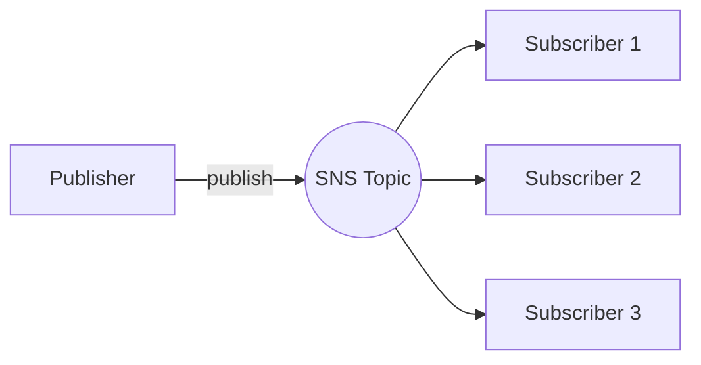
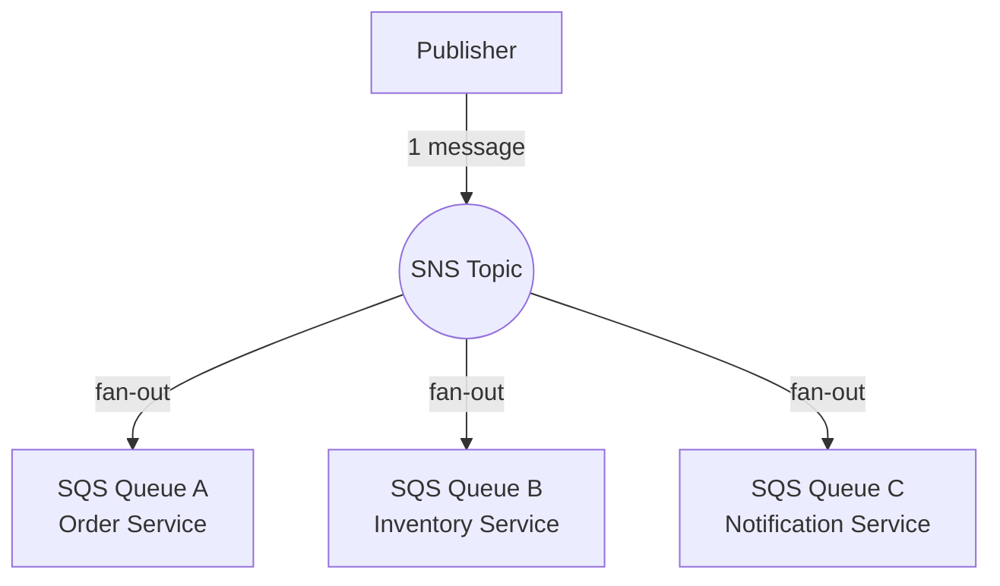
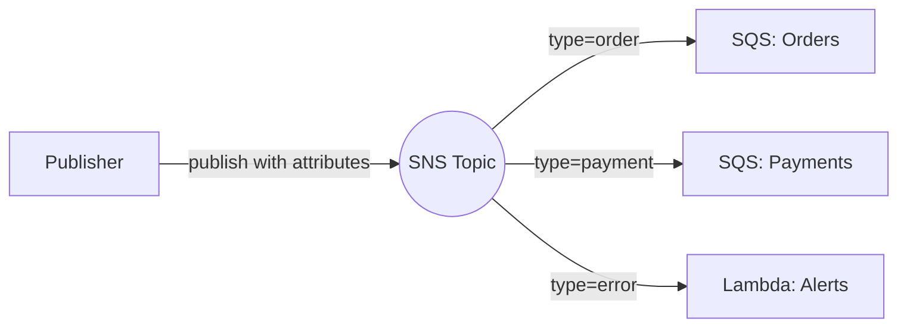

# Simple Notification Service (SNS)

SNS is a **pub/sub messaging service** — publishers send messages to a **topic**, and SNS delivers them to all **subscribers** automatically.

---

## Topics and Subscriptions

A **topic** is a channel. A **subscription** connects a topic to an endpoint (email, SQS, Lambda, etc.).



- One topic → many subscribers (one-to-many)
- Subscribers only receive messages published **after** they subscribe
- Supported protocols: Email, SMS, HTTP/S, SQS, Lambda, mobile push

---

## Fan-out Pattern

Send one message → multiple SQS queues process it **independently and in parallel**.



Why use it:
- Decouples services — each queue processes at its own pace
- No single point of failure — one queue failing doesn't affect others
- Easy to add new consumers without changing the publisher

---

## Subscriber Types

| Protocol | Use Case |
|----------|----------|
| **Email** | Alerts, notifications to humans |
| **SMS** | Text messages to phone numbers |
| **HTTP/S** | Webhooks to external services |
| **Lambda** | Serverless processing of messages |
| **SQS** | Durable queuing for async processing |

```mermaid
graph LR
    T((SNS Topic))
    T --> E[Email</br>user@example.com]
    T --> S[SMS</br>+1-555-0100]
    T --> H[HTTPS</br>webhook endpoint]
    T --> L[Lambda</br>function]
    T --> Q[SQS</br>queue]
```

---

## Message Filtering

By default, every subscriber gets **every message**. Filter policies let subscribers receive **only the messages they care about**.

You attach a filter policy to a **subscription** (not the topic).



**Example message attribute:**
```json
{
  "type": "order",
  "region": "us-east-1"
}
```

**Example filter policy on a subscription:**
```json
{
  "type": ["order"],
  "region": ["us-east-1", "us-west-2"]
}
```

The subscriber only receives messages where **all** filter conditions match.

---

##### Resource:
- [AWS SNS](https://youtu.be/bktTomENEX8?si=SuDpdPVAinjr9AHw)
