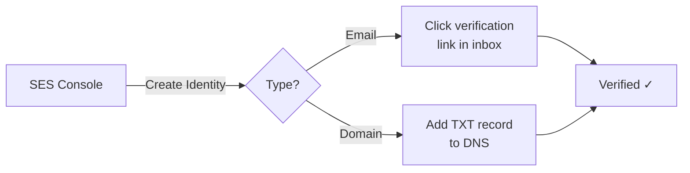
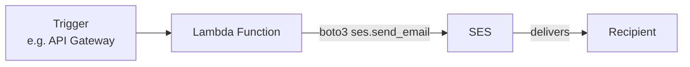
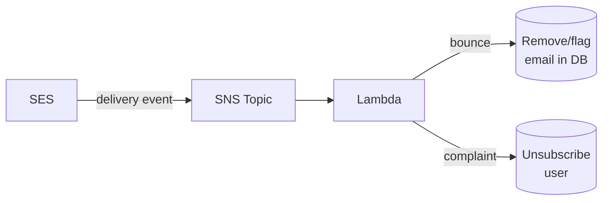
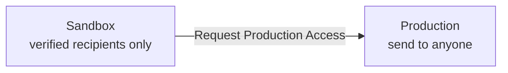

# Simple Email Service (SES)

SES is AWS's email sending service — for transactional emails (receipts, OTPs, alerts), bulk emails, and marketing.

---

## Verifying Identities and Domains

Before SES lets you send, you must **verify** that you own the sender address/domain.

**Two options:**

| Verify | What it means |
|--------|--------------|
| **Email address** | AWS sends a verification link to that address. Click it. Done. |
| **Domain** | Add DNS TXT records that AWS gives you. Proves you own the domain. |

Domain verification is preferred in production — lets you send from **any** address on that domain.

**Steps (AWS Console):**
1. Go to **SES → Verified Identities → Create Identity**
2. Choose **Email address** or **Domain**
3. Follow the verification instructions (check inbox or add DNS records)



---

## Sending Transactional Emails from Lambda

Lambda can call SES directly using boto3 — no SMTP needed.



**Lambda needs an IAM role with `ses:SendEmail` permission.**

```python
import boto3

ses = boto3.client("ses", region_name="us-east-1")

ses.send_email(
    Source="no-reply@yourdomain.com",
    Destination={"ToAddresses": ["user@example.com"]},
    Message={
        "Subject": {"Data": "Welcome!"},
        "Body": {"Text": {"Data": "Thanks for signing up."}},
    },
)
```

IAM policy for the Lambda role:
```json
{
  "Effect": "Allow",
  "Action": "ses:SendEmail",
  "Resource": "*"
}
```

---

## Handling Bounces and Complaints

**Bounce** — email address doesn't exist or rejected the email.
**Complaint** — recipient marked your email as spam.

Sending too many of these → AWS suspends your SES account. This is critical in production.



**Setup:**
1. **SES → Configuration Sets → Create** a configuration set
2. Add an **SNS destination** for bounce and complaint events
3. In your Lambda, parse the SNS notification and act on it:
   - **Bounce** → remove the email from your list
   - **Complaint** → unsubscribe the user immediately

> Aim for: bounce rate < 5%, complaint rate < 0.1%

---

## Moving Out of the SES Sandbox

By default, SES is in **sandbox mode**:
- You can only send TO verified email addresses
- Daily sending limit is 200 emails

To go to **production**:

1. Go to **SES → Account Dashboard → Request Production Access**
2. Fill in the form:
   - Expected sending volume
   - How you handle bounces/complaints
   - Use case description
3. AWS reviews and approves (usually within 24 hours)



---

## Email Templates

Templates let you define reusable HTML/text emails with **placeholders**.

**Create a template (CLI):**
```bash
aws ses create-template --cli-input-json '{
  "Template": {
    "TemplateName": "WelcomeEmail",
    "SubjectPart": "Welcome, {{name}}!",
    "TextPart": "Hi {{name}}, thanks for joining.",
    "HtmlPart": "<h1>Hi {{name}}</h1><p>Thanks for joining.</p>"
  }
}'
```

**Send using the template (boto3):**
```python
ses.send_templated_email(
    Source="no-reply@yourdomain.com",
    Destination={"ToAddresses": ["user@example.com"]},
    Template="WelcomeEmail",
    TemplateData='{"name": "Alice"}',
)
```

- Placeholders use `{{variable}}` syntax
- Template is stored in SES — reuse it across your app
- For bulk sends to many users, use `send_bulk_templated_email`

---

##### Resource:
- [AWS SES Docs](https://docs.aws.amazon.com/ses/latest/dg/Welcome.html)
