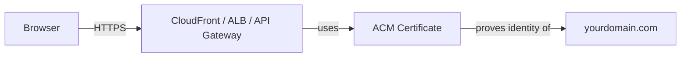
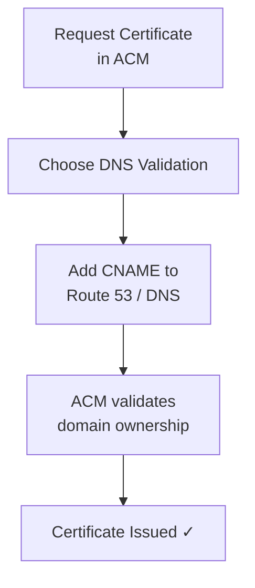
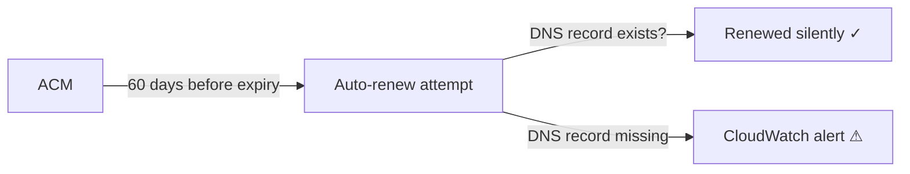

# ACM (AWS Certificate Manager)

ACM gives you **free, managed TLS/SSL certificates** for your AWS services. No buying, no manual renewals — AWS handles it.

---

## What ACM Is

A TLS certificate proves your server is who it says it is, and encrypts traffic between the client and server (HTTPS).

ACM issues and renews these certificates **for free** when used with AWS services.

> ACM certificates **cannot be downloaded** or used on non-AWS servers. For that, use Let's Encrypt.

---

## Issuing a Public Certificate

1. Go to **ACM → Request a certificate → Request a public certificate**
2. Enter your domain (e.g. `example.com` and `*.example.com` for wildcard)
3. Choose a validation method:

| Method | How it works | When to use |
|--------|-------------|-------------|
| **DNS validation** | Add a CNAME record to your DNS | Preferred — automatic renewal works |
| **Email validation** | Click a link sent to domain admin email | Use if you can't edit DNS |

4. For DNS validation, ACM gives you CNAME records to add in **Route 53** (or your DNS provider)
5. Once DNS propagates, certificate is issued (usually within a few minutes)

---

## Attaching Certificates to AWS Services

ACM certificates are **regional**, with one exception:

| Service | Region requirement |
|---------|-------------------|
| **CloudFront** | Must be in `us-east-1` (N. Virginia) |
| **ALB** | Must be in the same region as the ALB |
| **API Gateway** | Must be in the same region |

**CloudFront:**
- Distribution settings → **Custom SSL Certificate** → select your ACM cert

**ALB:**
- Listener (port 443) → **Add certificate** → select from ACM

**API Gateway:**
- Custom Domain Names → **ACM certificate**

---

## Automatic Certificate Renewal

ACM renews certificates **automatically** — no action needed from you, as long as:
- You used **DNS validation** (not email)
- The CNAME record is still present in your DNS

Certificates are renewed ~60 days before expiry. You get notified in ACM and via CloudWatch Events if renewal fails.

---

##### Resource:
- [ACM User Guide — AWS Docs](https://docs.aws.amazon.com/acm/latest/userguide/acm-overview.html)
