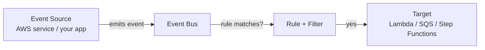
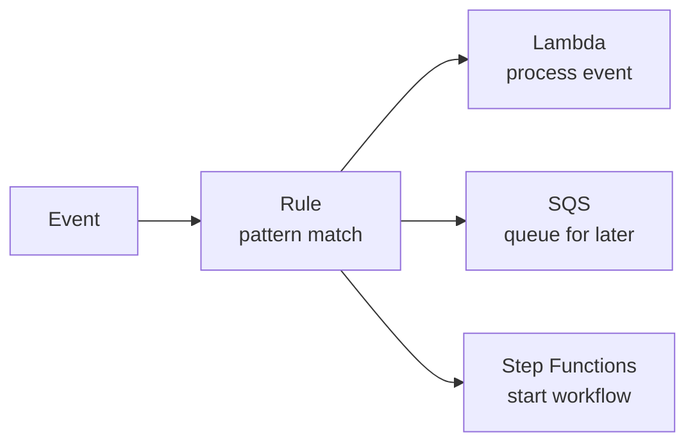
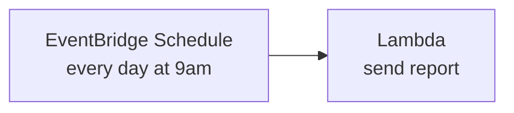

# EventBridge

EventBridge is a **serverless event bus** — it routes events from AWS services, your own apps, or third-party SaaS tools to targets like Lambda, SQS, or Step Functions.

Think of it as an intelligent router: something happens → EventBridge decides where to send it.

---

## Core Concepts: Events, Buses, and Rules



| Concept | What it is |
|---------|-----------|
| **Event** | A JSON object describing something that happened |
| **Event Bus** | The channel events flow through |
| **Rule** | A filter that decides which events go where |
| **Target** | Where the matched event is sent |

**Three types of event buses:**
- `default` — receives all AWS service events automatically
- **Custom bus** — for your own app events
- **Partner bus** — for SaaS tools (Shopify, Zendesk, etc.)

---

## AWS-Native Events vs. Custom Application Events

**AWS-native events** flow automatically into the `default` bus. Example: S3 puts an event when an object is uploaded, EC2 puts one when an instance changes state.

**Custom events** are events you emit from your own code:

```python
import boto3

eb = boto3.client("events")

eb.put_events(Entries=[{
    "Source": "myapp.orders",
    "DetailType": "OrderPlaced",
    "Detail": '{"orderId": "123", "amount": 59.99}',
    "EventBusName": "my-custom-bus",
}])
```

---

## Event Patterns and Filtering

Rules use **event patterns** to filter which events trigger them. Only matching events reach the target.

**Example: match only failed EC2 instance state changes**
```json
{
  "source": ["aws.ec2"],
  "detail-type": ["EC2 Instance State-change Notification"],
  "detail": {
    "state": ["terminated", "stopped"]
  }
}
```

**Example: match custom app events for a specific order region**
```json
{
  "source": ["myapp.orders"],
  "detail": {
    "region": ["us-east-1"]
  }
}
```

Only events that match **all conditions** in the pattern are forwarded to the target.

---

## Targets — Lambda, SQS, Step Functions, and More

One rule can have **up to 5 targets**. EventBridge delivers the event to all matching targets.



Common targets:
- **Lambda** — run code in response
- **SQS** — queue the event for async processing
- **Step Functions** — start a multi-step workflow
- **SNS** — fan out to multiple subscribers
- **Another EventBridge bus** — cross-account or cross-region routing

---

## Scheduled Events (Cron)

EventBridge replaced CloudWatch Events for scheduling. Use it to run Lambda functions on a schedule — no server needed.



**Rate expression:**
```
rate(1 hour)       # every hour
rate(5 minutes)    # every 5 minutes
```

**Cron expression:**
```
cron(0 9 * * ? *)  # every day at 9:00 AM UTC
```

Set this in: **EventBridge → Rules → Create Rule → Schedule**

---

##### Resource:
- [EventBridge User Guide — AWS Docs](https://docs.aws.amazon.com/eventbridge/latest/userguide/eb-what-is.html)
