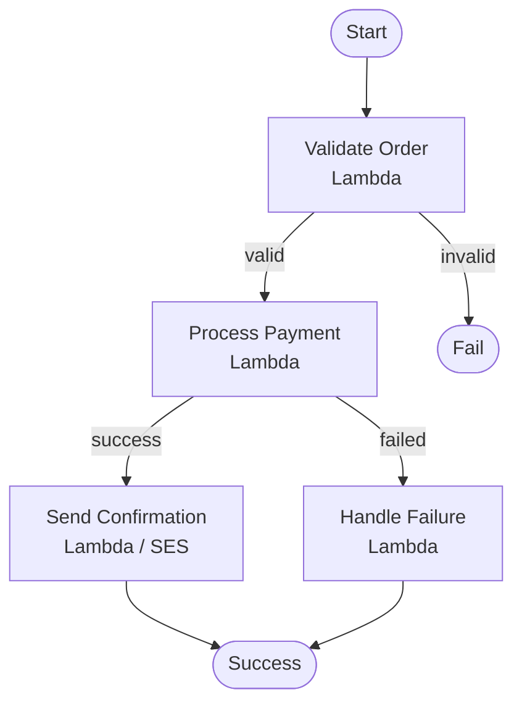
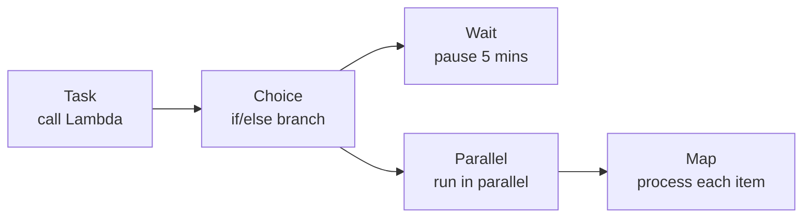
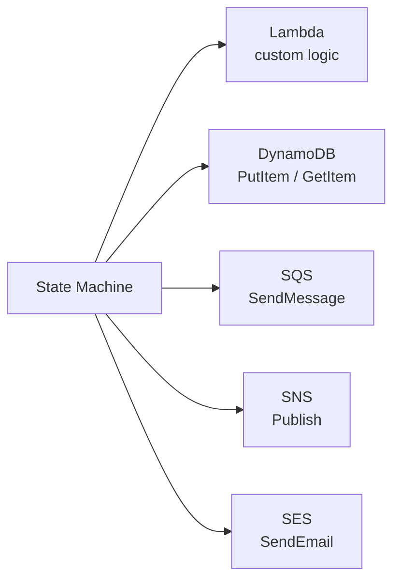

# Step Functions

Step Functions lets you **orchestrate Lambda functions (and other AWS services) into reliable multi-step workflows**. Instead of chaining Lambda calls in code, you define a state machine and AWS manages the execution, retries, and error handling.

---

## What Problem It Solves

Without Step Functions:
```
Lambda A calls Lambda B calls Lambda C
→ If C fails, you don't know where to retry
→ Error handling is buried in code
→ Hard to visualize what happened
```

With Step Functions:
```
State machine: A → B → C
→ Each step is visible in the console
→ Failures, retries, and timeouts are configured declaratively
→ AWS handles the execution state
```

---

## State Machines — States, Transitions, Inputs/Outputs

A **state machine** is a graph of **states** connected by **transitions**. Each execution moves through states, passing data (JSON) between them.



- **Input** — JSON passed into the state machine when execution starts
- **Output** — JSON returned from each state, passed to the next
- **Transitions** — conditions that determine the next state

---

## State Types

| State | What it does |
|-------|-------------|
| **Task** | Calls a Lambda, DynamoDB, SQS, or other service |
| **Choice** | Branches based on input conditions (like an if/else) |
| **Wait** | Pauses execution for a fixed time or until a timestamp |
| **Parallel** | Runs multiple branches simultaneously |
| **Map** | Iterates over an array, running states for each item |
| **Pass** | Passes input to output unchanged (useful for testing) |
| **Succeed / Fail** | Ends the execution as success or failure |



---

## Standard vs. Express Workflows

| | Standard | Express |
|--|----------|---------|
| **Max duration** | 1 year | 5 minutes |
| **Execution history** | Full audit trail in console | CloudWatch logs only |
| **Pricing** | Per state transition | Per execution + duration |
| **Use case** | Long-running business workflows | High-volume, short-lived workflows |

> Use **Standard** for order processing, approvals, multi-day workflows.
> Use **Express** for IoT pipelines, real-time data processing.

---

## Error Handling and Automatic Retries

Each Task state can define **retries** and **catch** blocks — no try/catch in Lambda code needed.

```json
"ProcessPayment": {
  "Type": "Task",
  "Resource": "arn:aws:lambda:...:function:ProcessPayment",
  "Retry": [{
    "ErrorEquals": ["States.TaskFailed"],
    "IntervalSeconds": 2,
    "MaxAttempts": 3,
    "BackoffRate": 2
  }],
  "Catch": [{
    "ErrorEquals": ["States.ALL"],
    "Next": "HandleFailure"
  }]
}
```

- **Retry** — retry up to 3 times with exponential backoff
- **Catch** — if all retries fail, go to `HandleFailure` state

---

## Integrating with Lambda, DynamoDB, SQS, and SNS

Step Functions can call AWS services **directly** without a Lambda wrapper (SDK integrations):



This keeps your Lambdas focused on business logic and avoids thin wrapper functions.

**Define a DynamoDB direct integration:**
```json
"SaveOrder": {
  "Type": "Task",
  "Resource": "arn:aws:states:::dynamodb:putItem",
  "Parameters": {
    "TableName": "Orders",
    "Item": {
      "orderId": { "S.$": "$.orderId" }
    }
  },
  "Next": "SendEmail"
}
```

---

##### Resource:
- [Step Functions Developer Guide — AWS Docs](https://docs.aws.amazon.com/step-functions/latest/dg/welcome.html)
