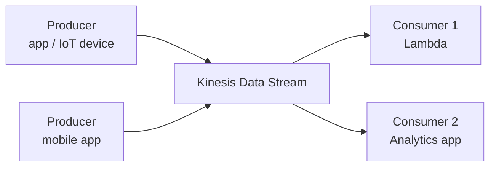
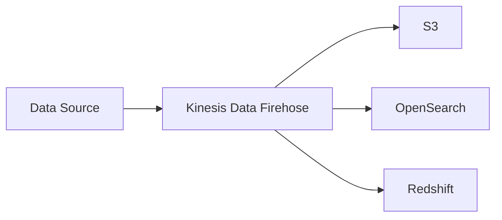

# Kinesis *(Awareness)*

Kinesis is AWS's **real-time data streaming platform**. It handles high-throughput, continuous streams of data — think millions of events per second from IoT devices, clickstreams, or application logs.

> This is an awareness topic. Most backend apps don't need Kinesis — use SQS/SNS first. Kinesis is for high-throughput real-time streaming use cases.

---

## Two Main Services

### Kinesis Data Streams

Captures and stores a continuous stream of records. Multiple consumers can read the same stream independently.

- Data is retained for 24 hours (up to 7 days)
- Ordered within a **shard** (a partition of the stream)
- You provision shards — each shard handles 1 MB/s in, 2 MB/s out

### Kinesis Data Firehose

Captures a stream and **automatically loads it into a destination** — no consumer code needed.

- Fully managed — no shards to configure
- Buffers data and delivers in batches (e.g. every 60 seconds or 5 MB)
- Optional: transform records with Lambda before delivery

---

## When to Choose Kinesis vs. SQS

| | SQS | Kinesis Data Streams |
|--|-----|----------------------|
| **Message ordering** | FIFO queues only | Ordered within a shard |
| **Multiple consumers** | One consumer per message | All consumers read all records |
| **Replay messages** | No | Yes (within retention window) |
| **Throughput** | Virtually unlimited | Provisioned per shard |
| **Use case** | Task queues, job processing | Real-time analytics, event sourcing |

**Rule of thumb:**
- Use **SQS** for task queues and decoupling services
- Use **Kinesis** when you need real-time processing, replay, or multiple independent consumers reading the same stream

---

##### Resource:
- [Kinesis Data Streams Overview — AWS Docs](https://docs.aws.amazon.com/streams/latest/dev/introduction.html)
