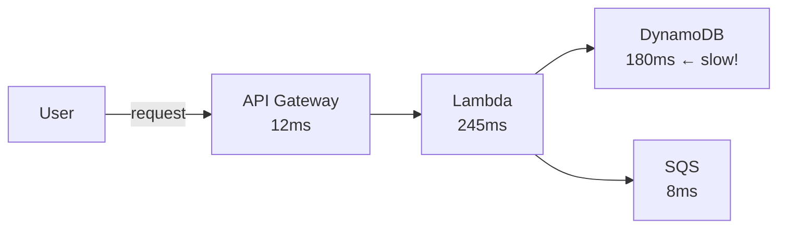
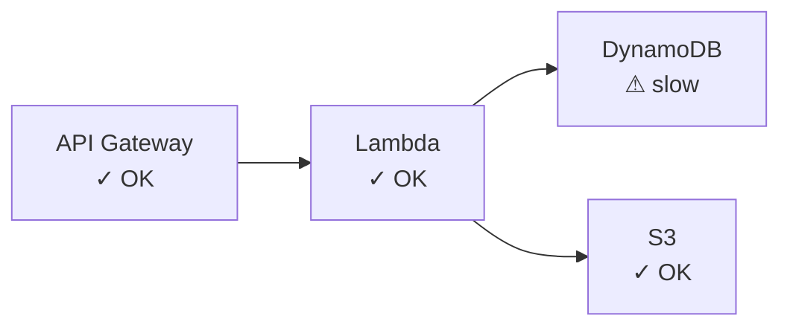
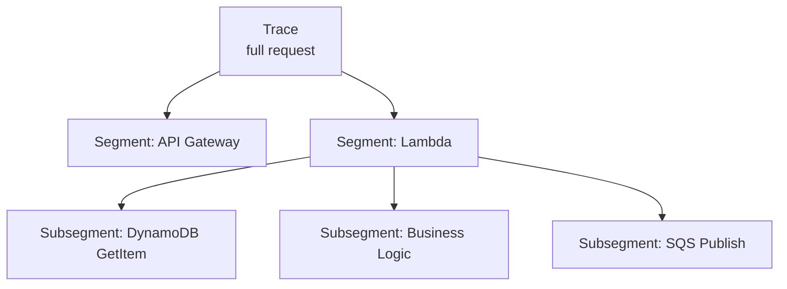

# AWS X-Ray

X-Ray gives you **distributed tracing** — it tracks a single request as it flows through your entire system (API Gateway → Lambda → DynamoDB → SQS → etc.) and shows you where time is being spent or where errors occur.

---

## What Distributed Tracing Is and Why It Matters

In a distributed system, a single user request may touch 5–10 services. When something is slow or broken, logs alone don't tell you which service is the problem.

X-Ray records a **trace** — a timeline of everything that happened for one request.



Without X-Ray: you check each service's logs separately.
With X-Ray: one view shows the full timeline and pinpoints the bottleneck.

---

## Instrumenting Lambda with the X-Ray SDK

**Step 1 — Enable X-Ray on your Lambda:**
- Lambda Console → your function → **Configuration → Monitoring and operations tools**
- Enable **Active tracing**

**Step 2 — Install the SDK in your function:**
```bash
pip install aws-xray-sdk
```

**Step 3 — Instrument your code:**
```python
from aws_xray_sdk.core import xray_recorder
from aws_xray_sdk.core import patch_all

patch_all()  # auto-instruments boto3 (DynamoDB, S3, SQS, etc.)

def handler(event, context):
    with xray_recorder.in_subsegment("my-custom-step"):
        # your logic here
        result = do_something()
    return result
```

- `patch_all()` — automatically traces all boto3 calls (no manual work)
- `in_subsegment()` — creates a named block on the trace timeline

Lambda needs this IAM permission:
```json
{ "Effect": "Allow", "Action": ["xray:PutTraceSegments", "xray:PutTelemetryRecords"], "Resource": "*" }
```

---

## Reading the X-Ray Service Map

The **service map** in the X-Ray console shows your architecture as a graph with health indicators.



Each node shows:
- **Request rate** — how many requests per second
- **Error rate** — % of 4xx errors
- **Fault rate** — % of 5xx errors
- **Latency** — average response time

---

## Identifying Latency Bottlenecks

Click any trace in the X-Ray console to see a **flame graph** — a horizontal timeline of every segment and subsegment.

```
Total: 300ms
├── Lambda init:         50ms
├── DynamoDB GetItem:   180ms  ← bottleneck
├── Business logic:      60ms
└── SQS SendMessage:     10ms
```

This immediately tells you: optimize the DynamoDB query, not the business logic.

---

## Segments and Subsegments

| Concept | What it is |
|---------|-----------|
| **Trace** | The full journey of one request end-to-end |
| **Segment** | One service's contribution to the trace (e.g. Lambda) |
| **Subsegment** | A named block inside a segment (e.g. a DynamoDB call, a custom step) |



- Segments are created automatically when X-Ray is enabled
- Subsegments are created automatically by `patch_all()` for AWS SDK calls
- Add custom subsegments with `xray_recorder.in_subsegment("name")` for your own code blocks

---

##### Resource:
- [X-Ray Developer Guide — AWS Docs](https://docs.aws.amazon.com/xray/latest/devguide/aws-xray.html)
- [X-Ray with Lambda — AWS Docs](https://docs.aws.amazon.com/lambda/latest/dg/services-xray.html)
