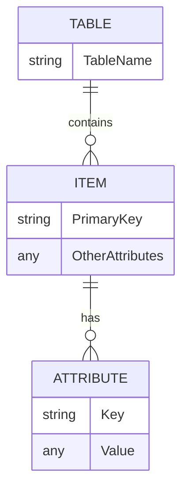
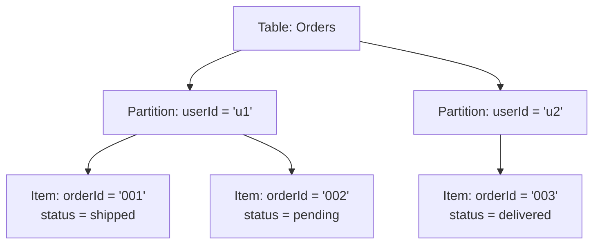
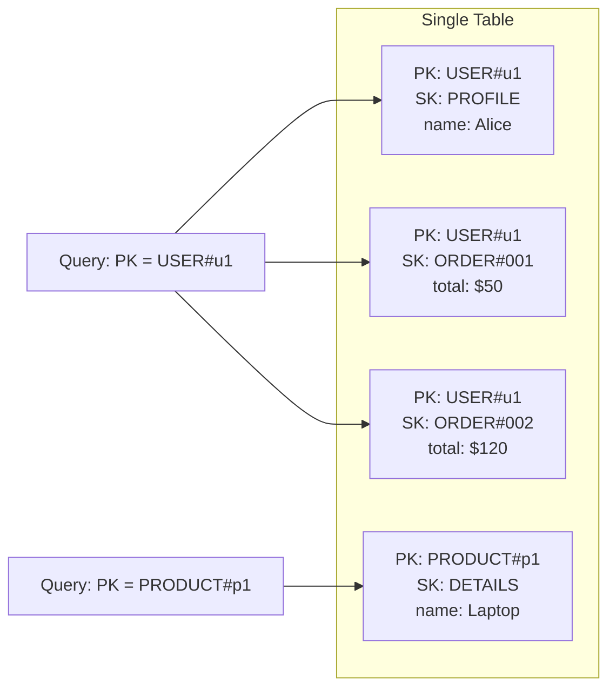
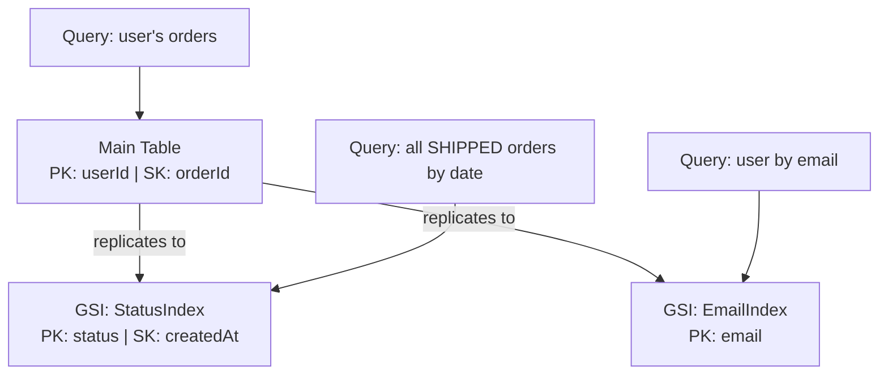
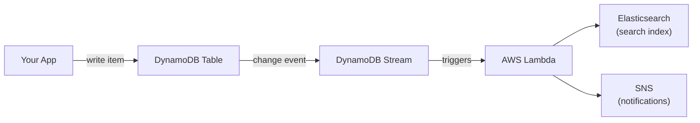

# DynamoDB

AWS's managed NoSQL database — optimized for performance at any scale. No SQL, no joins, just key-value/document storage with single-digit millisecond latency.

**When to use it:** Applications with known, predictable access patterns (e-commerce, gaming, real-time apps).
**When NOT to use it:** Complex relational queries, ad-hoc analytics → use RDS/Redshift instead.

---

## 1. Core Concepts: Tables, Items, Attributes

| DynamoDB | SQL Equivalent |
|----------|---------------|
| Table | Table |
| Item | Row |
| Attribute | Column |

- **Table** — a collection of items (e.g., `Users` table)
    - And tables are region specific, meaining that if there is a table named Orders in US-EAST-1, I can create another Orders table (within same AWS accound) in another region say ASIA or EU. and the data will also be region specific
- **Item** — a single record in a table (e.g., one user). Max size: **400KB**
- **Attribute** — a field on an item (e.g., `name`, `email`). No fixed schema — each item can have different attributes.



> Unlike SQL, you don't define columns upfront. Only the **primary key** is required on every item.

---

## 2. Partition Key & Sort Key

Every item needs a **Primary Key**. It comes in two flavors:

### Simple Primary Key (Partition Key only)
- A single attribute that uniquely identifies the item.
- DynamoDB hashes it to decide which partition (server) stores the item.

### Composite Primary Key (Partition Key + Sort Key)
- **Partition Key** — groups related items together (e.g., `userId`)
- **Sort Key** — orders items within that group (e.g., `createdAt`, `orderId`)
- Items can share a partition key, but the combination must be unique.



> **Rule:** Design your partition key to spread data evenly. A "hot" partition key (e.g., one user getting all traffic) = performance bottleneck.

---

## 3. On-Demand vs. Provisioned Capacity

DynamoDB charges you for **read/write capacity**. You pick how it's allocated:

| | On-Demand | Provisioned |
|--|-----------|-------------|
| **How it works** | Scales instantly, auto | You set RCU/WCU limits |
| **Billing** | Pay per request | Pay for reserved capacity |
| **Best for** | Unpredictable traffic | Steady, predictable traffic |
| **Cost** | Higher per-request | Cheaper at scale |

- **RCU** (Read Capacity Unit) = 1 strongly consistent read of ≤4KB/sec (or 2 eventually consistent reads)
- **WCU** (Write Capacity Unit) = 1 write of ≤1KB/sec

**Start with On-Demand** while prototyping. Switch to Provisioned when traffic patterns stabilize.

---

## 4. Single-Table Design

> This is the biggest mental shift from SQL. In SQL, you normalize data into many tables and JOIN them. In DynamoDB, **you put everything in one table**.

### Why?
DynamoDB charges per read. JOINs don't exist — every additional query = additional cost + latency. Single-table design lets you fetch all related data in **one query**.

### How it works

You overload `PK` and `SK` to represent multiple entity types:

| PK | SK | Data |
|----|----|------|
| `USER#u1` | `PROFILE` | name, email |
| `USER#u1` | `ORDER#001` | total, status |
| `USER#u1` | `ORDER#002` | total, status |
| `PRODUCT#p1` | `DETAILS` | name, price |



> **Key insight:** Design your table around your **access patterns** first, data model second. Ask: "What queries does my app need?" — then design `PK/SK` to answer those queries efficiently.

---

## 5. Global Secondary Indexes (GSIs)

Your main table can only be queried by its `PK` (and `SK`). A **GSI** lets you query by a different attribute.

- A GSI is essentially a **copy of your table** with a different PK/SK
- You can have up to **20 GSIs** per table
- GSIs have their own capacity (or inherit on-demand)
- Data is replicated asynchronously → **eventually consistent reads only**



**Example use case:** Your main table is `PK=userId, SK=orderId`. To query "all orders with status=shipped", you create a GSI with `PK=status, SK=createdAt`.

---

## 6. DynamoDB Streams

Streams capture a **time-ordered log of every change** (insert, update, delete) to your table. Each record stays in the stream for **24 hours**.

**Use cases:**
- Trigger a Lambda on data changes (event-driven architecture)
- Replicate data to another table or service
- Audit logs / change history



**Stream view types** (what gets recorded):
| Type | What's captured |
|------|----------------|
| `KEYS_ONLY` | Only the PK/SK |
| `NEW_IMAGE` | The item after the change |
| `OLD_IMAGE` | The item before the change |
| `NEW_AND_OLD_IMAGES` | Both before and after |

---

## 7. DynamoDB Document Client (SDK)

The **boto3** library is the standard way to interact with DynamoDB from Python. Use the `resource` interface — it automatically handles Python ↔ DynamoDB type conversion.

```bash
pip install boto3
```

```python
import boto3

dynamodb = boto3.resource("dynamodb", region_name="us-east-1")
table = dynamodb.Table("Orders")

# PUT — create/replace an item
table.put_item(Item={
    "userId": "u1",
    "orderId": "001",
    "status": "pending",
    "total": 50
})

# GET — fetch a single item by PK (+ SK if composite)
response = table.get_item(Key={"userId": "u1", "orderId": "001"})
item = response.get("Item")

# QUERY — fetch multiple items by PK
from boto3.dynamodb.conditions import Key

response = table.query(
    KeyConditionExpression=Key("userId").eq("u1")
)
items = response["Items"]

# DELETE — remove an item
table.delete_item(Key={"userId": "u1", "orderId": "001"})
```

> **Avoid `Scan`** — it reads the entire table and is expensive. Always use `Query` with a partition key.

---

## Example 1: Creating & Accessing a Table:

### Step 1: Create a new table from AWS Console
- Give a table name - Orders
- Create a partition key (primary key) that uniquely identifies an item (row) - Orderid - string
- Create a sort key (if only the partition key could contain duplicates) - CreationDate - string (**Note: The partition key cannot be added after the table gets created, so be mindful of it when creating/using it.**)
- Choose Read/write capacity settings:
    - On-demand: only billed for actual reads and writes to the table
    - Provisioned: allows more configurations - like configuring auto scaling, etc... (choose this)


### Step 2: 

---

###### Resources
- [DynamoDB Beginners Guide](https://www.youtube.com/watch?v=2k2GINpO308)
- [AWS DynamoDB Docs](https://docs.aws.amazon.com/dynamodb/)
- [Single-Table Design (Rick Houlihan)](https://www.youtube.com/watch?v=HaEPXoXVf2k)
