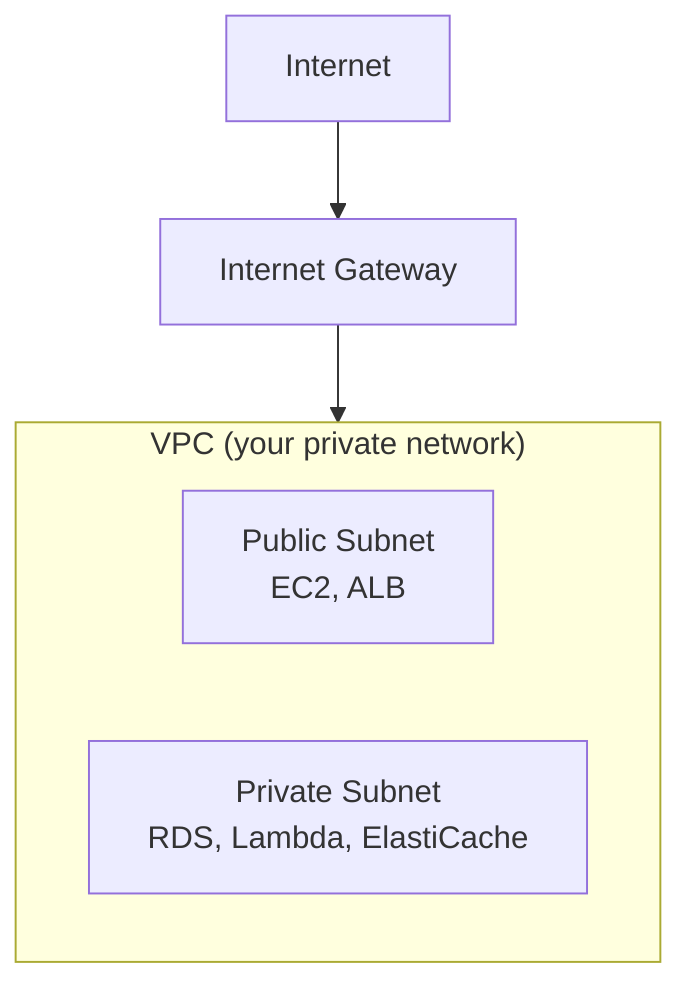
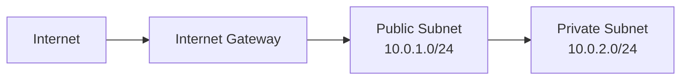
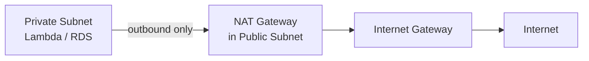
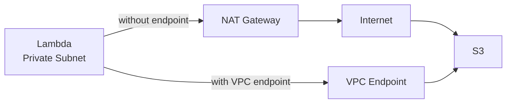
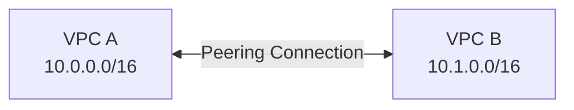
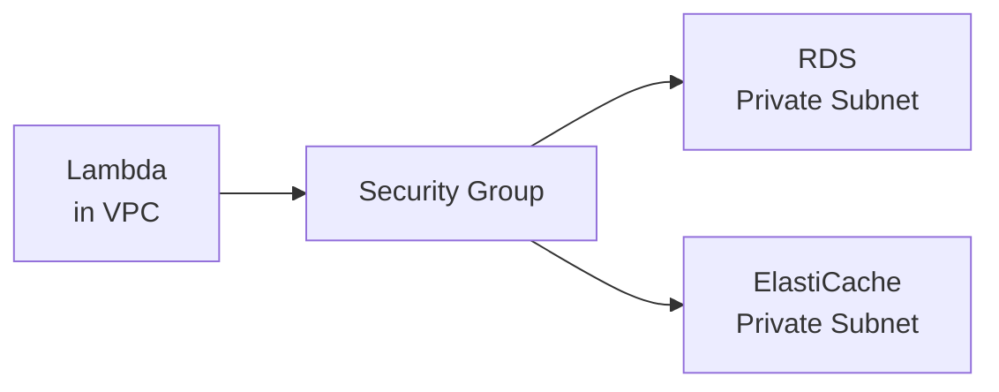

# VPC (Virtual Private Cloud)

A VPC is your **own private network inside AWS**. Every resource you create (EC2, RDS, Lambda, etc.) lives inside a VPC — you control who can reach what.

---

## What a VPC Is

Think of it as a fenced-off section of the AWS cloud. Nothing gets in or out unless you explicitly allow it.

- **Region-scoped** — one VPC lives in one AWS region
- **Default VPC** — AWS creates one for you per region. Fine to use while learning.
- **CIDR block** — the IP range for your VPC (e.g. `10.0.0.0/16`)

---

## Subnets — Public vs. Private

A **subnet** is a slice of your VPC's IP range, tied to one Availability Zone.

| Type | Has internet access? | Common resources |
|------|---------------------|-----------------|
| **Public** | Yes (via Internet Gateway) | EC2, ALB, NAT Gateway |
| **Private** | No direct internet | RDS, ElastiCache, Lambda |

---

## Route Tables and Internet Gateways

A **route table** tells traffic where to go. Every subnet is associated with one.

- **Internet Gateway (IGW)** — connects your VPC to the internet
- Public subnet route table has a route: `0.0.0.0/0 → IGW`
- Private subnet route table has no internet route (by default)

---

## NAT Gateway — Private Subnets Calling the Internet

A resource in a private subnet can't reach the internet directly. A **NAT Gateway** lets it make outbound requests (e.g. downloading packages) without being reachable from the internet.

- NAT Gateway lives in the **public** subnet
- Private subnet route: `0.0.0.0/0 → NAT Gateway`
- NAT Gateway is **not free** — costs per hour + data processed

---

## Security Groups vs. Network ACLs

Both are firewalls, but they work differently.

| | Security Group | Network ACL |
|---|---|---|
| **Attached to** | EC2 / RDS / Lambda | Subnet |
| **Stateful?** | Yes — return traffic auto-allowed | No — must explicitly allow both directions |
| **Default** | Deny all inbound, allow all outbound | Allow all |
| **When to use** | Most cases | Extra layer for subnets |

> For most setups, Security Groups are enough. NACLs are an extra layer for strict environments.

---

## VPC Endpoints — Stay Inside AWS

By default, a Lambda in a private subnet can't reach S3, DynamoDB, or SQS without going through the internet (via Network Access Translation (NAT) Gateway). **VPC Endpoints** let you connect to AWS services without leaving the AWS network — faster and cheaper.

Two types:
- **Gateway endpoint** — for S3 and DynamoDB (free)
- **Interface endpoint** — for everything else (costs per hour)

---

## VPC Peering

Connects two VPCs so their resources can communicate as if on the same network. Useful for multi-account setups or separate environments.

- Not transitive — if A peers with B and B peers with C, A cannot reach C
- Both VPCs must have non-overlapping CIDR ranges

---

## Connecting Lambda and ElastiCache/RDS via VPC

Lambda is **not inside your VPC by default**. To connect to RDS or ElastiCache (which are private), you must put Lambda inside the same VPC.

**Steps:**
1. Create a Lambda function
2. Under **VPC settings**, select your VPC and private subnets
3. Attach a security group that has access to RDS/ElastiCache
4. Add a NAT Gateway if Lambda also needs internet access

> Lambda in a VPC has a cold start overhead — use provisioned concurrency if latency matters.

---

##### Resource:
- [VPC Getting Started — AWS Docs](https://docs.aws.amazon.com/vpc/latest/userguide/vpc-getting-started.html)
