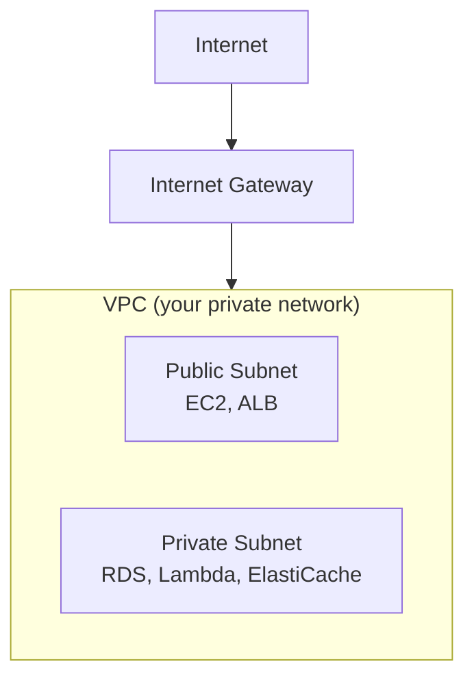
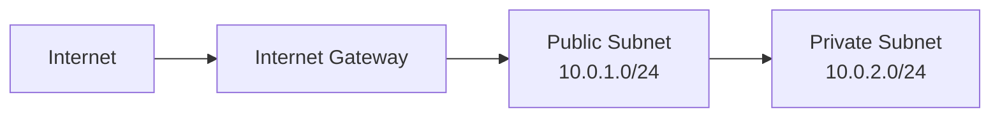
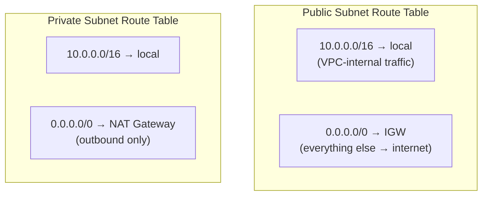
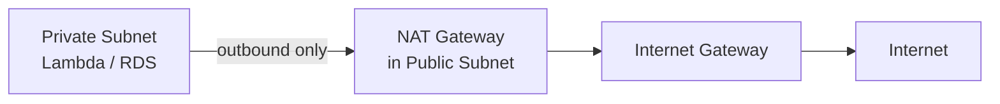
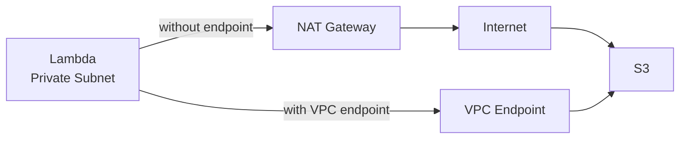
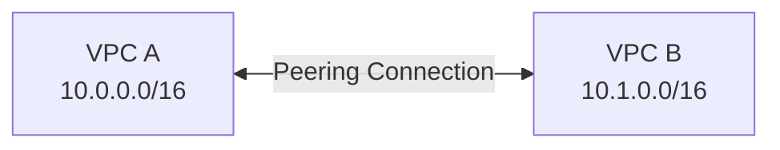
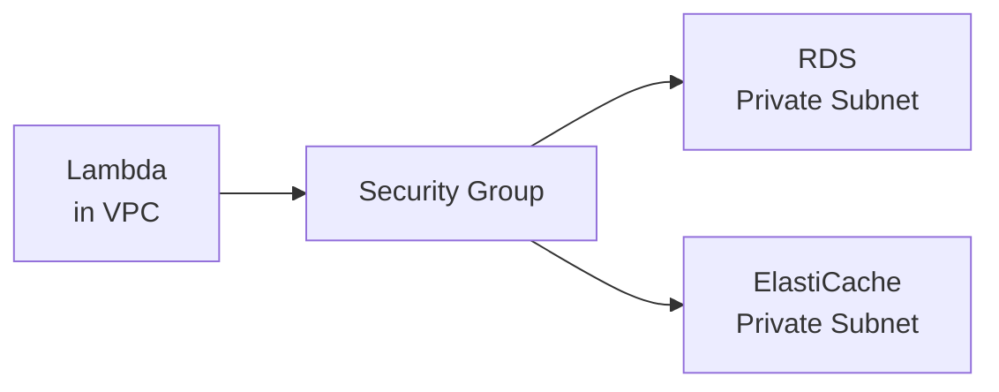
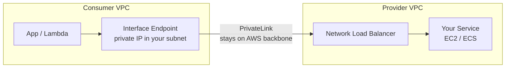
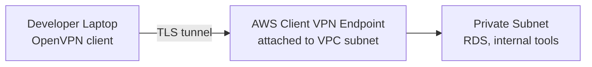

# VPC (Virtual Private Cloud)

A VPC is your **own private network inside AWS**. Every resource you create (EC2, RDS, Lambda, etc.) lives inside a VPC — you control who can reach what.

---

## What a VPC Is

Think of it as a fenced-off section of the AWS cloud. Nothing gets in or out unless you explicitly allow it.



- **Region-scoped** — one VPC lives in one AWS region
- **Default VPC** — AWS creates one for you per region. Fine to use while learning.
- **CIDR block** — the IP range for your VPC (e.g. `10.0.0.0/16`)

### VPC IP Address Range (CIDR)

When you create a VPC you assign it a **CIDR block** — this is the pool of private IPs all your resources draw from.

```
10.0.0.0/16   →  65,536 total IPs  (10.0.0.0 – 10.0.255.255)
10.0.0.0/24   →     256 total IPs  (10.0.0.0 – 10.0.0.255)
10.0.0.0/28   →      16 total IPs  (smallest AWS allows for a subnet)
```

The number after `/` is the **prefix length** — the higher it is, the smaller the range.

**Subnets carve up the VPC's range:**

```
VPC:              10.0.0.0/16
  Public subnet:  10.0.1.0/24   (256 IPs, AZ-a)
  Private subnet: 10.0.2.0/24   (256 IPs, AZ-a)
  Private subnet: 10.0.3.0/24   (256 IPs, AZ-b)
```

Rules:
- Subnet CIDR must fall entirely within the VPC's CIDR
- Subnets in the same VPC cannot overlap
- AWS **reserves 5 IPs** per subnet (first 4 + last 1), so a `/24` gives you 251 usable IPs

> **Practical default:** start with `10.0.0.0/16` for the VPC, then `/24` subnets. This gives you room to grow without running out of IPs.

---

## Subnets — Public vs. Private

A **subnet** is a slice of your VPC's IP range, tied to one Availability Zone.

| Type | Has internet access? | Common resources |
|------|---------------------|-----------------|
| **Public** | Yes (via Internet Gateway) | EC2, ALB, NAT Gateway |
| **Private** | No direct internet | RDS, ElastiCache, Lambda |



---

## Route Tables and Internet Gateways

A **route table** is a set of rules that tell traffic where to go. Every subnet is associated with exactly one route table.

Each route has two parts:

| Field | Meaning |
|---|---|
| **Destination** | The IP range this rule applies to (e.g. `0.0.0.0/0` = all traffic) |
| **Target** | Where to send matching traffic (IGW, NAT Gateway, VPC Endpoint, local…) |

The router always picks the **most specific** matching route first.



- **Internet Gateway (IGW)** — connects your VPC to the internet
- A subnet is "public" solely because its route table has `0.0.0.0/0 → IGW`
- A subnet is "private" because its route table has no IGW route (or routes via NAT)
- You can have multiple route tables in one VPC — one per subnet type is typical

---

## NAT Gateway — Private Subnets Calling the Internet

A resource in a private subnet can't reach the internet directly. A **NAT Gateway** lets it make outbound requests (e.g. downloading packages) without being reachable from the internet.



- NAT Gateway lives in the **public** subnet
- Private subnet route: `0.0.0.0/0 → NAT Gateway`
- NAT Gateway is **not free** — costs per hour + data processed

---

## Security Groups vs. Network ACLs

Both are firewalls, but they work differently.

| | Security Group | Network ACL |
|---|---|---|
| **Attached to** | EC2 / RDS / Lambda | Subnet |
| **Stateful?** | Yes — return traffic auto-allowed | No — must explicitly allow both directions |
| **Default** | Deny all inbound, allow all outbound | Allow all |
| **When to use** | Most cases | Extra layer for subnets |

> For most setups, Security Groups are enough. NACLs are an extra layer for strict environments.

### Inbound / Outbound Rules

**Inbound rules** — control traffic arriving at the resource.
**Outbound rules** — control traffic leaving the resource.

Each rule defines:
- **Type / Protocol** — TCP, UDP, ICMP, or All
- **Port range** — e.g. `443`, `5432`, `0–65535`
- **Source / Destination** — an IP range (`0.0.0.0/0` = anywhere) or another Security Group ID

```mermaid
graph LR
    Client -->|HTTPS :443</br>inbound rule allows| SG[Security Group]
    SG --> EC2[EC2 Instance]
    EC2 -->|response traffic</br>auto-allowed (stateful)| Client

    EC2 -->|outbound rule</br>allows :5432| SG2[RDS Security Group]
    SG2 --> RDS[(RDS)]
```

**Key behaviour — stateful:**
If an inbound rule allows a request in, the response is automatically allowed out — you do not need a matching outbound rule. This is what "stateful" means.

**Common patterns:**

| Scenario | Inbound rule on... | Allow |
|---|---|---|
| Public web server | EC2 SG | `0.0.0.0/0` on port `443` |
| RDS only reachable from Lambda | RDS SG | Lambda's SG ID on port `5432` |
| Lambda calling the internet | Lambda SG outbound | `0.0.0.0/0` on all ports |

> Referencing another Security Group as the source (instead of an IP) is the preferred pattern inside a VPC — it survives IP changes automatically.

---

## VPC Endpoints — Stay Inside AWS

By default, a Lambda in a private subnet can't reach S3, DynamoDB, or SQS without going through the internet (via Network Access Translation (NAT) Gateway). **VPC Endpoints** let you connect to AWS services without leaving the AWS network — faster and cheaper.



Two types:
- **Gateway endpoint** — for S3 and DynamoDB (free)
- **Interface endpoint** — for everything else (costs per hour)

---

## VPC Peering

Connects two VPCs so their resources can communicate as if on the same network. Useful for multi-account setups or separate environments.



- Not transitive — if A peers with B and B peers with C, A cannot reach C
- Both VPCs must have non-overlapping CIDR ranges

---

## Connecting Lambda and ElastiCache/RDS via VPC

Lambda is **not inside your VPC by default**. To connect to RDS or ElastiCache (which are private), you must put Lambda inside the same VPC.



**Steps:**
1. Create a Lambda function
2. Under **VPC settings**, select your VPC and private subnets
3. Attach a security group that has access to RDS/ElastiCache
4. Add a NAT Gateway if Lambda also needs internet access

> Lambda in a VPC has a cold start overhead — use provisioned concurrency if latency matters.

---

## AWS PrivateLink

PrivateLink lets you **expose a service privately** to other VPCs or AWS accounts — without VPC Peering, without the traffic ever touching the internet.

It's the technology underneath Interface VPC Endpoints. The difference:

| | VPC Endpoint (Interface) | PrivateLink (your own service) |
|---|---|---|
| **What it connects to** | AWS-managed services (SQS, Secrets Manager…) | Your own service (e.g. an internal API on a NLB) |
| **Who sets it up** | You (consumer side only) | You on both sides: provider creates an Endpoint Service, consumer creates an Interface Endpoint |



**When to use PrivateLink over VPC Peering:**
- You want to expose **one specific service**, not the whole VPC
- The two VPCs have overlapping CIDR ranges (Peering won't work)
- You're a SaaS provider and want customers to access your service privately

---

## Client VPN

Client VPN lets **individual users** (developers, on-call engineers) connect to your VPC from their laptop over an encrypted tunnel. Think of it as a traditional corporate VPN, but managed by AWS.



- Uses **OpenVPN** — any standard OpenVPN client works (AWS provides one too)
- The Client VPN endpoint is associated with a subnet in your VPC
- You control access via **authorization rules** — which users/groups can reach which CIDR ranges
- Authentication options: **AWS Certificate Manager** (mutual TLS) or **Active Directory / SSO**

**Common use case:** a developer needs to run Alembic migrations or query RDS directly. Instead of making RDS public, they connect via Client VPN and hit the private IP.

> Client VPN is billed per endpoint-hour + per connection-hour. Not free, but much safer than opening RDS to the internet.

---

##### Resource:
- [VPC Introduction](https://www.youtube.com/watch?v=3FumWkHSusY)
- [VPC Getting Started — AWS Docs](https://docs.aws.amazon.com/vpc/latest/userguide/vpc-getting-started.html)
